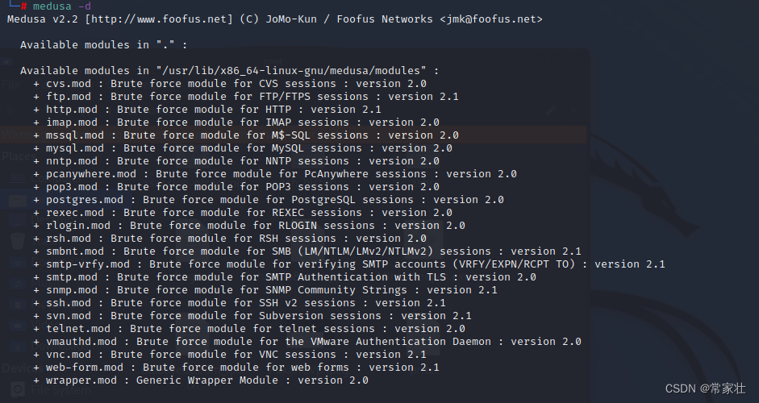
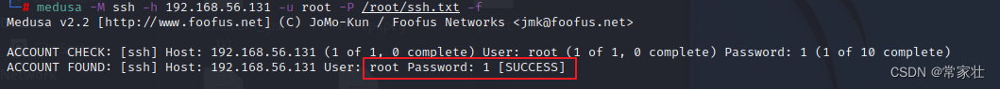
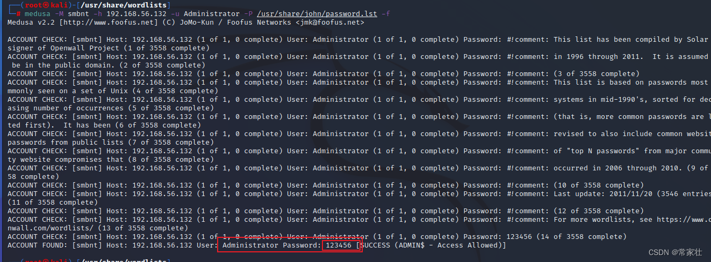

[https://www.kali.org/tools/medusa](https://www.kali.org/tools/medusa/)


# 语法以及参数说明：

```bash
语法：Medusa [-h host |-h file] [-u用户名| -u文件][-p密码|-p文件] [C文件] -M模块[OPT]
```


| 参数       | 说明                                                         |
| ---------- | ------------------------------------------------------------ |
| -h[TEXT]   | 目标主机名或IP地址                                           |
| -H[FILE]   | 包含目标主机名或IP地址的文件                                 |
| -u[TEXT]   | 要测试的用户名                                               |
| -U[FILE]   | 包含要测试的用户名的文件                                     |
| -p[TEXT]   | 测试密码                                                     |
| -P[FILE]   | 包含要测试的密码的文件                                       |
| -C[FILE]   | 包含组合项的文件。有关更多信息，请参阅自述文件。             |
| -O[FILE]   | 要附加日志信息的文件                                         |
| -e[n/s/ns] | 附加密码检查（[n]无密码，[s]密码=用户名）                    |
| -M[TEXT]   | 要执行的模块的名称（不带.mod扩展名）                         |
| -m[TEXT]   | 要传递给模块的参数。可以使用每次不同的参数，它们都将被发送到模块（即。-m参数1-m参数2等 |
| -d         | 显示所有已安装的模块                                         |
| -n[NUM]    | 用于非默认TCP端口号                                          |
| -s         | 启用SSL                                                      |
| -g[NUM]    | 尝试连接NUM秒后放弃（默认值3）                               |
| -r[NUM]    | 重试尝试之间的睡眠NUM秒数（默认值为3）                       |
| -R[NUM]    | 在放弃之前尝试NUM重试。总尝试次数将为NUM+1。                 |
| -c[NUM]    | 等待usec验证套接字可用的时间（默认为500 usec）。             |
| -t[NUM]    | 同时测试的登录总数                                           |
| -T[NUM]    | 同时测试的主机总数                                           |
| -L         | 每个线程使用一个用户名并行登录。默认为处理继续之前输入整个用户名。 |
| -f         | 找到第一个有效用户名/密码后，停止扫描主机。                  |
| -F         | 在任何主机上找到第一个有效的用户名/密码后，停止审计。        |
| -b         | 禁止启动横幅                                                 |
| -q         | 显示模块的使用信息                                           |
| -v[NUM]    | 详细级别[0-6（更多）]                                        |
| -w[NUM]    | 错误调试级别[0-10（更多）]                                   |
| -V         | 显示版本                                                     |
| -Z[TEXT]   | 根据上次扫描的地图恢复扫描                                   |

# 例如：查看已安装的所有模块

```bash
medusa -d
```



# 例如：爆破 ssh 协议

用到的自带字典 ：/usr/share/john/password.lst 或 /usr/share/wordlists/ 下面的某个字典
**参数解释：**
**-h：要爆破的目标主机IP地址 192.168.56.131
-l：要爆破的用户名 root
-P：要爆破的密码字典 用的字典是我自己弄的
-M：调用模块ssh执行
-f：一旦爆破成功一个就立即停止爆破**

```bash
medusa -M ssh -h 192.168.56.131 -u root -P /usr/share/john/password.lst -f
```



# 例如：爆破Windows远程远程桌面协议(smbnt)3389

用到的自带字典 ：/usr/share/john/password.lst 或 /usr/share/wordlists/ 下面的某个字典
**参数解释：**
**-h：要爆破的目标主机IP地址 192.168.56.132
-l：要爆破的用户名 Administrator
-P：要爆破的密码字典 /usr/share/john/password.lst
-M：调用smbnt模块执行
-f：一旦爆破成功一个就立即停止爆破**

```bash
medusa -M smbnt -h 192.168.56.132 -u Administrator -P /usr/share/john/password.lst -f
```




# 模块相关

一、工具运行

从路径运行：/usr/bin/medusa 。


二、并发功能

示例：

medusa -H hosts.txt -U users.txt -P passwords.txt -T 20 -t 10 -L -F -M smbnt

参数说明：

-T ：并发处理的host数量。

-t ：并发测试的login数量。

-M ：指定模块，此例中是smbnt。


三、复合文件的编写

参数-C用于指定复合文件；复合文件中同时包含：目标IP地址、login名、口令，格式如下：

目标IP地址:login名:口令

示例：

192.168.1.1:username:userpwd

192.168.1.2:username:userpwd

192.168.1.3:username:userpwd

假设复合文件名是combo.txt，运行命令示例如下：

medusa -M smbnt -C combo.txt


四、常用模块

模块具体细节：

### AFP

AFP模块根据Apple Filing Protocol服务测试帐户。

该AFP模块利用基于afpfs-ng FUSE的客户端（http://alexthepuffin.googlepages.com/home）。目前的Medusa autoconf设置要求将afpfs-ng头文件安装到/ usr / include / afpfs-ng，libary位于/usr/lib/libafpclient.so.0。如果这与您的设置不匹配，则需要修改autoconf配置。

### CVS

CVS模块通过pserver协议对CVS版本控制系统进行测试。

该模块有一个选项DIR。这允许用户指定目标CVSROOT路径。例如：pserver：USER @ HOST：/ SOME_DIR。如果该选项未设置，则默认行为是使用/ root。

### FTP

FTP模块根据FTP和FTPS服务测试帐户。这包括显式FTPS（RFC 4217中定义的AUTH TLS模式）和隐式（FTP over SSL（990 / tcp））。

### HTTP

HTTP模块使用BASIC-AUTH，集成Windows身份验证（NTLM）和摘要（MD5和MD5-sess），对HTTP / HTTPS服务进行测试。

### IMAP

IMAP模块根据IMAP服务测试帐户。该模块支持imap（143）和imaps（993）。IMAP模块要求服务器的功能，然后根据其响应进行LOGIN或AUTHENTICATE PLAIN。

### MS-SQL

MSSQL模块根据Microsoft MS-SQL服务测试帐户。

应该注意的是，MS-SQL Developer Edition和/或MSDE的并发工作负载调控器可以将您的服务器任意时间限制在不超过五个并发连接。

MSSQL模块将自动检测远程主机上SQL Server实例使用的TCP端口。这是通过“SQL Ping”UDP请求完成的。如果主机上存在多个实例，则仅测试第一个实例。将报告任何其他实例，并注明其各自的TCP端口。通过使用Medusa“-n”选项指定端口，可以覆盖自动检测。

### MySQL

MySQL模块针对MySQL服务测试帐户。

除了正常的密码爆破外，该模块还支持旧的MySQL（4.1之前）散列的“哈希传递”功能。旧的MySQL 4.1之前的认证方案很容易受到哈希传递认证攻击。利用从MySQL数据库收集的旧式散列，用户可以使用Medusa验证其在其他服务器上的有效性。修改的MySQL客户端也可以直接使用有效的哈希连接到远程服务。

### NetWare NCP

NCP模块根据NetWare NCP服务测试帐户。该模块是使用NetWare 5.1主机作为目标开发的。

该模块需要ncpfs。还必须使用“install-dev”选项安装ncpfs软件包。这将安装ncpfs头文件和静态libncp库。修改后的Gentoo ebuild已包含在/ misc / net-fs / ncpfs目录中，该目录包含此选项的USE标志。

该模块有一个选项，即CONTEXT。应该注意的是，libncp默认情况下不会自动指定用户上下文。如果无法解析提供的名称，则会将服务器的上下文附加到用户名，并尝试解析该值。建议用户为正在测试的每个帐户指定上下文。可以使用CONTEXT选项指定全局上下文。每个用户上下文可以被定义为包含用户名或通过命令行传递文件中的用户名作为帐户名称的一部分。

以下示例演示了NCP模块的多种用途：

- 为users.txt中的所有帐户指定上下文：

`% medusa -h 192.168.0.20 -U users.txt -p bar -M ncp -m CONTEXT:.OU=administrators.O=foofus`·

- 通过“-u”参数传递完整的用户上下文：

```
% medusa -h 192.168.0.20 -u username.OU=administrators.O=foofus -p bar -M ncp
```

默认情况下，Libncp也使用NDS和BIND身份验证器。不幸的是，返回到模块的唯一错误消息是BIND认证器的错误消息。这些消息不像NDS那样描述，只是似乎报告成功或失败。为了获得更多有用的消息（帐户禁用/超过最大登录数等信息），请使用以下文本创建一个〜/ .nwclient或/etc/ncpfs.conf文件：

```
[Requester]NetWare Protocol = NDS
```

### NNTP

NNTP模块通过AUTHINFO根据网络新闻传输协议测试帐户。

### 远程控制软件

PcAnywhere模块根据Symantec PcAnywhere服务测试帐户。

注意：PcAnywhere一次只允许一个连接。每个目标运行多个线程可能无法正常工作。

基于Server Version 10.5.1和Client 10.0.2的数据包捕获模块。

PCA验证方法： ADS（Active Directory服务）[1] FTP [2] HTTP [2] HTTPS [2] Microsoft LDAP [2] Netscape LDAP [2] Novell LDAP [2] NT [1] pcAnywhere [1] Windows [ 3] [1]已验证的工作 [2]未测试 [3]当PcAnywhere主机对域帐户进行身份验证时，验证工作。 对于具有模块和PcAnywhere的本地帐户，身份验证失败 目前还不知道发生了什么…

### POP3

POP3模块针对POP3服务测试帐户。

该模块有一个选项MODE。如果未设置，默认行为是检查服务器响应中的“+”或“ – ”，以查看尝试是否成功。

如果服务器在AS / 400中进行测试，则应使用该选项执行该模块`-m MODE:AS400`。这将导致返回的-ERR消息被解析以获取附加信息。这是基于从以下文档收集的信息：Enumeration_of_AS400_users_via_pop3.pdf

该模块支持POP3（110 / tcp）和POP3S（POP3协议通过TLS / SSL）（995 / tcp）。此外，它还支持POP3 STARTTLS扩展，如http://www.faqs.org/rfcs/rfc2595.html中所定义。Medusa将向目标服务器提交“STLS”命令。如果返回正响应，则会启动TLS会话。

### PostgreSQL

postgres模块根据PostgreSQL服务来测试帐户。

该模块需要PostgreSQL库：[libpq](https://link.zhihu.com/?target=https%3A//www.gitbook.com/book/anyeduke/the-pentesting-of-kali-tools/edit%23)。

该模块有一个选项DB。这允许用户指定目标数据库名称。如果该选项未设置，默认行为是使用template1。

### REXEC

REXEC模块根据REXEC服务测试帐户。

### RDP

RDP模块根据Microsoft远程桌面协议（RDP）/终端服务测试帐户。应该注意的是，仅适用于运行Microsoft 2008及更高版本的目标系统。对Microsoft XP / 2003 / etc的测试将始终报告登录成功。

此模块需要FreeRDP。pass-the-hash选项也仅在安装FreeRDP版本1.2或更高版本时可用。

FreeRDP主分支的预构建二进制文件可从https://ci.freerdp.com获取。可用于Ubuntu，Debian，Fedora和OpenSUSE。nightly版本安装在/ opt / freerdp-nightly中，可以与发行版的常规freerdp软件包并行安装。如果Medusa在其构建过程中检测到此版本，则应该通过任何其他安装版本的FreeRDP构建该版本。

例如，以下工作适用于2015年11月11日的Kali 2.0：- 访问：http://ci.freerdp.com/job/freerdp-nightly-binaries/architecture=amd64,distribution=jessie,label=pkg-deb

- 下载：freerdp-nightly_1.2.1 + 0〜20151104024829.185〜1.gbpb83356_amd64.deb
- 下载：freerdp-nightly-dev_1.2.1 + 0〜20151104024829.185〜1.gbpb83356_amd64.deb
- 安装：dpkg -i freerdp-nightly * -更新运行时路径：echo / opt / freerdp-nightly / lib / >> /etc/ld.so.conf;ldconfig – 构建Medusa：./configure;make

以下示例演示了RDP模块的多种用途：

- 使用pass-the-hash（NTLM）登录尝试：

```
medusa -M rdp -m PASS:HASH -h 10.10.10.10 -u Administrator -p 31D78236327B9619B14ED8EC9AB454C1
```

- 提供域名的登录尝试（默认行为是本地登录）：

```
medusa -M rdp -m DOMAIN:CORPNAME -h 10.10.10.10 -u Administrator -p Password1
```

### RLOGIN

RLOGIN模块根据RLOGIN服务测试帐户。

### RSH

RSH模块根据RSH服务测试帐户。

### SMBNT

http://foofus.net/goons/jmk/medusa/medusa-smbnt.html

### SMTP-AUTH

用于使用TLS（STARTTLS扩展）进行SMTP验证的强力模块。

### SMTP-VRFY

SMTP-VRFY模块用于枚举哪些帐户在邮件服务器上是十分有效。该模块发送以下内容：

```
EHLO some_name` `VRFY account@domain
```

模块期望通过用户选项（-u / -U / -C）检查帐户。应该提供域名，如果它是一个密码。通过EHLO命令发送的值可以使用`-m EHLO:`模块选项进行设置。默认是发送MEDUSA。

此模块是在测试单个错误配置的SMTP垃圾邮件过滤器时编写的。其他设备的行为可能不一样。可能需要对模块进行某些调整。

### SNMP

SNMP模块根据简单网络管理协议（SNMP）服务测试社区字符串。

该模块有几个选项：TIMEOUT，VERSION和ACCESS。默认值为2秒，版本1和READ访问。应该注意的是，当测试WRITE功能时，模块将读取sysLocation的当前值，然后将相同的值写回系统。

由于SNMP是基于UDP的协议，因此在发送和接收传输层实体之间不存在握手。由于这种无连接通信，只有当我们知道SNMP服务存在时，才能发送正确的社区字符串，并且服务器发送响应。所有其他查询都不会导致任何响应。我们在这里使用的方法是最初只发送我们所有的SNMP GET请求。完成后，我们等待TIMEOUT秒的任何响应。如果我们得到任何回应，我们检查他们看看哪些public字符串是成功的。如果指定了ACCESS：WRITE，我们检查每个先前成功的值的写访问权限。快速而暴力。

### SSH

SSH模块使用SSHv2对SSH服务进行测试。该模块目前支持强制SSH键盘交互和密码验证模式。

该模块需要libssh2（www.libssh2.org）。这与libssh（0xbadc0de.be）不同。应该注意的是，libssh2库，因此，Medusa SSH模块只支持强制服务器，可以与SSHv2通信。Libssh2不支持v1，它看起来可能永远不会。

该模块有一个选项，BANNER。如果不明显，则允许您设置认证测试期间发送的客户端。默认值为“SSH-2.0-MEDUSA”。

关于libssh2的一些注意事项使用库存libssh2库，运行Medusa时，用户可能会遇到挂起的模块线程。这个问题是由于libssh2的libssh2_session_startup（）并不总是返回值，这是libssh2中挂起的原因。OpenSSH的默认行为是仅允许10个未认证的连接，并忽略其他所有内容。虽然我们在测试中并不总是运行10个线程，但是我们的线程可能比目标清除之前的连接更快地击中它们

同时问题有两个方面：

- libssh2永远等待ssh服务器用banner回应。这使我们的线程永远等待，这是一个打击。我在/ misc目录中添加了一个修补程序到
  libssh2，使其计数到1000，然后停止等待。这个小修补程序已经提交给libssh2的人，一个修复程序将有希望被包含在将来的版本中。
- 我们现在循环访问libssh2_session_startup（）调用。如果libssh2无法协商SSH会话，此功能将失败。我们给它5张照片通过并在每个休眠之间设置一个用户可配置的时间。如果我们在5次尝试后失败，我们会显示发生这种情况，并确定未测试的主机/用户/
  通行证组合。

**从libssh2 0.18（devel）开始，这个问题似乎解决了。**

应该注意的是，虽然你可以运行许多SSH的线程，但并不是越多越好好。当您在10个以上时，您将注意到该模块会重试startup（）函数

### Subversion（SVN）

SVN模块根据Subversion（SVN）服务来测试帐户，该模块需要安装svn_client-1库。这应该作为[Subversion的](https://link.zhihu.com/?target=https%3A//www.gitbook.com/book/anyeduke/the-pentesting-of-kali-tools/edit%23)一部分安装。

该模块有一个选项，BRANCH。这允许用户指定目标SVN URL。例如，svn：// host / branch。如果该选项未设置，则默认行为是使用中继。

### 远程登录

TELNET模块根据TELNET服务测试帐户。该模块支持telnet（23）和telnet（992）。

该模块目前有一个选项MODE。MODE可以是NORMAL（默认）或AS400。AS400模式支持基本的AS / 400 tn5250连接。当对AS / 400进行测试时，此方法允许比FTP更具描述性的错误消息。但是，如果在AS / 400上可用，POP3仍然是更好的暴力选项。

Telnet模块将输出到发现只有密码提示的日志文件主机。当扫描使用或缺少AAA时，这可能是有用的。

VMware身份验证守护程序（vmauthd）

VMWAUTHD模块根据VMware身份验证守护程序测试帐户。它支持服务的非SSL和SSL加密安装。

### VNC

VNC模块根据VNC服务测试帐户。

该模块使用RealVNC和UltraVNC开发，支持基本的抗暴力功能。例如，RealVNC允许5次尝试失败，然后执行10秒延迟。对于后续尝试，延迟加倍。UltraVNC似乎允许6次无效尝试，然后在每次尝试之间强制10秒延迟。此模块尝试识别这些情况，并通过调用sleep（）进行适当的响应。使用MAXSLEEP参数强制强制RealVNC时，用户可设置休眠限制。一旦达到此值，模块将退出。

此模块支持无密码和仅密码身份验证以及UltraVNC MS-Logon（本地/域Windows凭据）用户名/密码凭据。

### 通用包装

封装模块的目的是允许用户执行任意脚本，同时利用Medusa管理主机/用户/密码。包装器目录中包含两个示例脚本。

这是一个正在进行的工作…该模块目前使用的是不理想的fork（）。不知道我是否可以启动一个线程，并重定向STDIN / STDOUT线程…

该模块的初始目标是使用rdesktop测试RDP服务器。rdesktop 1.4.1的修补程序已包含在/ misc / rdesktop目录中。这扩展了从http://cqure.net的字典修补程序与Medusa包装器STDIN方法。应该注意的是，当连接到Windows 2000主机时，rdesktop似乎不能使用命令行密码。Windows 2003和XP在测试过程中工作正常。

以下示例显示了使用rdesktop与包装器模块的

```
medusa -M wrapper -m TYPE:STDIN -m PROG:rdesktop -m ARGS:"-u %U -p - %H" -H hosts.txt -U users.txt -P passwords.txt
```

一种方法：用于隐藏rdesktop图形输出的一种可能方法：`% Xvfb :97 -ac -nolisten tcp &` `% export DISPLAY=:97`

### Web表单

用于处理GET / POST请求的基本web表单强力模块。支持可定制的提交参数和服务器响应文本。
