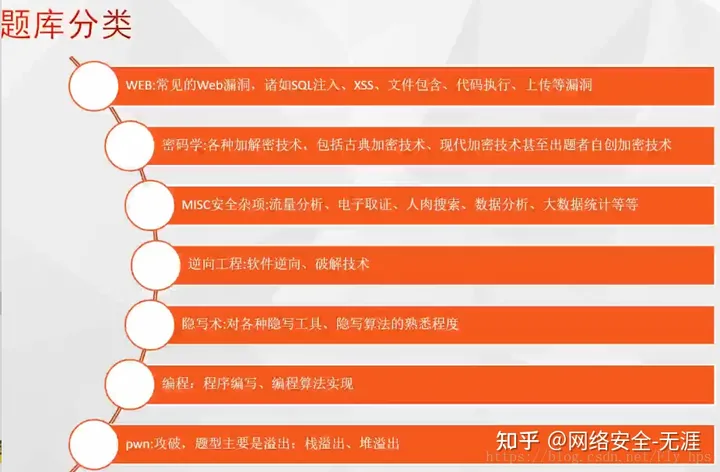

# 2023最全CTF入门指南

## 一、CTF简介

CTF（Capture The Flag）中文一般译作夺旗赛，在网络安全领域中指的是网络安全技术人员之间进行技术竞技的一种比赛形式。CTF起源于1996年DEFCON全球黑客大会，以代替之前黑客们通过互相发起真实攻击进行技术比拼的方式。发展至今，已经成为全球范围网络安全圈流行的竞赛形式，2013年全球举办了超过五十场国际性CTF赛事。而DEFCON作为CTF赛制的发源地，DEFCON CTF也成为了目前全球最高技术水平和影响力的CTF竞赛，类似于CTF赛场中的“世界杯” 。

## 二、CTF竞赛模式

- **解题模式（Jeopardy）：**在解题模式CTF赛制中，参赛队伍可以通过互联网或者现场网络参与，这种模式的CTF竞赛与ACM编程竞赛、信息学奥赛比较类似，以解决网络安全技术挑战题目的分值和时间来排名，通常用于在线选拔赛。题目主要包含逆向、漏洞挖掘与利用、Web渗透、密码、取证、隐写、安全编程等类别。
- **攻防模式（Attack-Defense）：**在攻防模式CTF赛制中，参赛队伍在网络空间互相进行攻击和防守，挖掘网络服务漏洞并攻击对手服务来得分，修补自身服务漏洞进行防御来避免丢分。攻防模式CTF赛制可以实时通过得分反映出比赛情况，最终也以得分直接分出胜负，是一种竞争激烈，具有很强观赏性和高度透明性的网络安全赛制。在这种赛制中，不仅仅是比参赛队员的智力和技术，也比体力（因为比赛一般都会持续48小时及以上），同时也比团队之间的分工配合与合作。
- **混合模式（Mix）：**结合了解题模式与攻防模式的CTF赛制，比如参赛队伍通过解题可以获取一些初始分数，然后通过攻防对抗进行得分增减的零和游戏，最终以得分高低分出胜负。采用混合模式CTF赛制的典型代表如iCTF国际CTF竞赛。

## 三、CTF各大题型简介

- **MISC（安全杂项）**：全称Miscellaneous。题目涉及流量分析、电子取证、人肉搜索、数据分析、大数据统计等等，覆盖面比较广。我们平时看到的社工类题目；给你一个流量包让你分析的题目；取证分析题目，都属于这类题目。主要考查参赛选手的各种基础综合知识，考察范围比较广。
- **PPC（编程类）**：全称Professionally Program Coder。题目涉及到程序编写、编程算法实现。算法的逆向编写，批量处理等，有时候用编程去处理问题，会方便的多。当然PPC相比ACM来说，还是较为容易的。至于编程语言嘛，推荐使用Python来尝试。这部分主要考察选手的快速编程能力。
- **CRYPTO（密码学）**：全称Cryptography。题目考察各种加解密技术，包括古典加密技术、现代加密技术甚至出题者自创加密技术。实验吧“角斗场”中，这样的题目汇集的最多。这部分主要考查参赛选手密码学相关知识点。
- **REVERSE（逆向）**：全称reverse。题目涉及到软件逆向、破解技术等，要求有较强的反汇编、反编译扎实功底。需要掌握汇编，堆栈、寄存器方面的知识。有好的逻辑思维能力。主要考查参赛选手的逆向分析能力。此类题目也是线下比赛的考察重点。
- **STEGA（隐写）**：全称Steganography。隐写术是我开始接触CTF觉得比较神奇的一类，知道这个东西的时候感觉好神奇啊，黑客们真是聪明。题目的Flag会隐藏到图片、音频、视频等各类数据载体中供参赛选手获取。载体就是图片、音频、视频等，可能是修改了这些载体来隐藏flag，也可能将flag隐藏在这些载体的二进制空白位置。有时候需要你侦探精神足够的强，才能发现。此类题目主要考查参赛选手的对各种隐写工具、隐写算法的熟悉程度。实验吧“角斗场”的隐写题目在我看来是比较全的，以上说到的都有涵盖。新手盆友们可以去了解下。
- **PWN（溢出）**：PWN在黑客俚语中代表着攻破，取得权限，在CTF比赛中它代表着溢出类的题目，其中常见类型溢出漏洞有栈溢出、堆溢出。在CTF比赛中，线上比赛会有，但是比例不会太重，进入线下比赛，逆向和溢出则是战队实力的关键。主要考察参数选手漏洞挖掘和利用能力。
- **WEB（web类）**：WEB应用在今天越来越广泛，也是CTF夺旗竞赛中的主要题型，题目涉及到常见的Web漏洞，诸如注入、XSS、文件包含、代码审计、上传等漏洞。这些题目都不是简单的注入、上传题目，至少会有一层的安全过滤，需要选手想办法绕过。且Web题目是国内比较多也是大家比较喜欢的题目。因为大多数人开始安全都是从web日站开始的。

## 四、CTF学习路线

## 4.1、初期

刚刚走进大学，入了web安全的坑，面对诸多漏洞必然是迷茫的，这时的首要任务就是打好网站开发的基础，曾有伟人说过-“自己不会做网站，何谈去找网站的漏洞”，在学习漏洞前，了解基本网站架构、基础网站开发原理，基础的前后端知识，能够让你之后的漏洞学习畅通无阻。

### 1、html+css+js（2-3天）

前端三要素 html、css、js是被浏览器解析的代码，是构成静态页面的基础。也是前端漏洞如xss、csrf的基础。

**☆重点了解html和js**

推荐学习资料：

- [https://www.runoob.com/](https://www.runoob.com/)
- [https://www.w3school.com.cn/](https://www.w3school.com.cn/)

能力要求：

- 能够写出简单表单，能够通过js获取DOM元素，控制DOM树即可。

### 2、apache+php （4-5天）

推荐使用phpstudy来进行傻瓜式安装，可以少走很多弯路。通过apache+php体会一下网站后端的工作，客户端浏览器通过请求apache服务器上的php脚本，php执行后生成的html页面返回给浏览器进行解析。

**☆重点了解php**

推荐学习资料：

- [https://www.runoob.com/](https://www.runoob.com/)
- [https://www.w3school.com.cn/](https://www.w3school.com.cn/)

能力要求：

- 了解基本网站原理，了解php基本语法，开发简单动态页面

### 3、mysql （2-3天）

之前已经安装的phpstudy可以轻易的安装mysql。mysql是一款典型的关系型数据库，一般来说，大部分网站都会带有数据库进行数据存储。

**☆重点了解sql语句**

推荐学习资料：

- [https://www.runoob.com/](https://www.runoob.com/)
- [https://www.w3school.com.cn/](https://link.zhihu.com/?target=https%3A//www.w3school.com.cn/)

能力要求：

- 能够用sql语句实现增删改查，并且能用php+mysql开发一个增删改查的管理系统（如学生管理系统）

### 4、python (2-3天)

虽然 “php是最好的语言”，但它主要还是应用在服务端做网站开发，我们搞安全经常需要写一些脚本或工具来进行诸如密码爆破、目录扫描、攻击自动化等操作，需要一个方便且趁手的编程语言，这里我推荐python

**☆重点学习requests、BeautifulSoup、re这三个库**

推荐学习资料

- [https://www.runoob.com/](https://link.zhihu.com/?target=https%3A//www.runoob.com/)
- [https://www.w3school.com.cn/](https://link.zhihu.com/?target=https%3A//www.w3school.com.cn/)

能力要求：

- 了解python基础语法，能够用python爬取网站上的信息（requests+BeautifulSoup+re）

### 5、burpsuite （1-2天）

web安全的工具很多，但我觉得必备的渗透工具还得是它

重点学习Proxy、Repeater、Intruder三个模块，分别用于抓包放包、重放包、爆破

初步使用即可，在中期的漏洞学习中去逐渐熟练它

推荐学习资料

- DVWA之暴力破解

能力要求：

- 能够用burpsuite抓包改包、爆破用户名密码

## 4.2、中期

此时我们对网站已经不再陌生，能够自己动手完成一个简单站点。但我们写出来的代码真的安全吗？进入中期，我们便要开始着眼经典漏洞的学习。

一个漏洞的学习，要搞明白三点（每学完一个漏洞就问自己这三个问题）：

- 如何利用这个漏洞？
- 为什么会产生这个漏洞？
- 如何修复这个漏洞？

### 1、SQL注入（7-8天）

我们web狗学习的第一个漏洞一般都是SQL注入，它是web安全经典中的经典，也是在这里被灌输 “永远不信任用户的输入” 的口号，即使是现在sql注入也依旧存在，并且它还在不断衍生出如nosql注入、ORM注入等，可谓防不胜防。

推荐学习资料：

- sqli-labs：如何使用它网上有很多教学，wp也有很多大佬写了 这里贴一个[https://blog.csdn.net/wang_624/article/details/101913584](https://blog.csdn.net/wang_624/article/details/101913584)
- sqlmap：sql注入神器，有余力可以去看看它的源码，学习一下大佬进行sql注入并把它自动化的思路
- buuctf：找相关的真题进行练习 wp百度一搜就有
- [极客大挑战 2019]EasySQL
- [极客大挑战 2019]LoveSQL
- [SUCTF 2019]EasySQL

能力要求：

- 能够手工注入出任意表的数据，熟悉三种盲注的手法，能够通过sql注入实现任意文件读取和任意文件写入，能够自己编写一个不含sql注入的查询功能

### 2、文件上传（7-8天）

webshell是可以进行代码执行的木马

而文件上传其实就是想办法把webshell上传到目标的服务器上去并成功解析，达到控制目标服务器的目的，这也是web安全的一个重点内容

推荐学习资料

- upload-labs：几乎涵盖所有上传漏洞类型
- buuctf：找相关的真题进行练习（[ACTF2020 新生赛]Upload）
- 趁手的webshell管理工具： 蚁剑

能力要求：

- 会写php的webshell，明白webshell的原理，熟悉常见的文件上传绕过方法（如过后缀检测、过文件头检测、过MIME类型检测），能够自己编写一个不含漏洞的上传功能

### 3、其他漏洞（14-15天）

以上两个漏洞是我认为一个初学者最应该掌握也是最典型的漏洞，涵盖了代码执行、文件操作、数据库操作等web应用的主体内容。然而web安全的世界还有很多的漏洞需要你去探索，不过学会了这两种漏洞的你去学其他漏洞定然是游刃有余，不会像刚开始那么困惑了。

以下四个为中期要掌握的漏洞

- 命令执行（RCE）：php常见的代码执行（eval）、命令执行（system）函数
- 文件包含：file协议、php伪协议的利用
- XSS：通过XSS获取用户cookie
- CSRF：通过csrf让用户点击恶意链接就触发敏感操作

## 4.3、后期

此时的你熟悉了web安全几个核心的漏洞，并且有了一些ctf题目的练习经验，已经是一个合格的ctfer了。恭喜你。成功入门web安全。后续的学习方法或许该由你自己决定，我在此只给一些建议。

**多多参与CTF赛事**

参与当下举行的ctf赛事是最好的学习方法之一，即使是初学者也能够找到一些适合自己能力的赛事，比如极客大挑战、UNCTF、各个大学的新生赛等等都是不错的选择，在比赛中去发现自己知识的不足，然后去针对的补充这部分知识，是很好的学习循环，无需迷茫的去到处获取知识，而是在需要时去学习。

Tips: 或许有人觉得直接刷题是一样的，但完全不是，当下比赛中的题往往更加前沿和流行，你可以找到当下的ctf题目趋势，紧跟技术热点，而且可以多多融入ctf竞技的氛围中，成长的更快。

- ctfhub：可以很方便的查看最近举行的ctf赛事

**多多看其他师傅的博客**

打完ctf比赛的你肯定是想看writeup（答案）的，一般来说赛后过几天就会有很多师傅发出他的writeup，从比赛群、百度等途径都可以找到。多多看看其他师傅的解题思路，关注几个大牛，看看他们发的技术文章，都是很好的学习方法。

## 五、CTF学习资源

## 5.1、CTF赛题复现平台

- **BUUCTF**

1. 拥有大量比赛的复现环境
2. 国内较早使用动态靶机的CTF复现平台·定期举办各类公开赛
3. 提供平台开源环境·较全的比赛Writeup

- **CTFHub**

1. 各类比赛历年真题
2. 较为体系化的技能树
3. 较全的CTF工具集
4. 较全的赛事日历
5. 较全的比赛WriteUp

- **BugKu**

1. 国内较早的CTF复现平台(在buu和ctfhub还没火的时候bugku很有名)·较为基础的题目
2. 较全的WriteUp

- **Pwnable**

1. 适合Pwn新手入门题目较为友好

## 5.2、赛事与资讯

- **DEF CON CTF**

1. 国际最顶尖的CTF赛事
2. 主赛事+外卡赛
3. 决赛与DEF CON同期举办

- **CTFTime**

1. 较全的国际CTF赛事信息·
2. 较全的CTF战队信息·
3. 较为权威的CTF战队排名。
4. 各大赛事WriteUp
5. 各大赛事日历

- **BUUCTF**

1. 前面说过不重复讲了

- **XCTF国际联赛**

1. 国内较早的CTF联赛
2. 国内第一个出海办比赛的CTF赛事·
3. 在国际上具有一定知名度
4. 部分学校可以加分甚至保研

各类赛事太多了，这里没法——罗列，大家前期可以刷一些校赛和小比赛，进阶刷i春秋、XCTF,后期直接刷CTFTime各类国际赛

## 5.3、博客与论坛

- 先知社区：[https://xz.aliyun.com](https://link.zhihu.com/?target=https%3A//xz.aliyun.com)。
- 看雪论坛：[http://bbs.pediy.com/](https://link.zhihu.com/?target=http%3A//bbs.pediy.com/)。
- 安全客：[http://anquanke.com/](https://link.zhihu.com/?target=http%3A//anquanke.com/).
- FreeBuf [http://freebuf.com/](https://link.zhihu.com/?target=http%3A//freebuf.com/)。
- P神博客[http://leavesongs.com/](https://link.zhihu.com/?target=http%3A//leavesongs.com/)。
- 代码审计[http://t.zsxq.com/UrJiUBY](https://link.zhihu.com/?target=http%3A//t.zsxq.com/UrJiUBY)·
- 漏洞百出[http://t.zsxq.com/fEmluBe](https://link.zhihu.com/?target=http%3A//t.zsxq.com/fEmluBe).
- CTFWP@Nu1 [http://Lt.zsxq.com/JluJi23](https://link.zhihu.com/?target=http%3A//Lt.zsxq.com/JluJi23)

## 5.4、书籍推荐

- **CTF WiKi**

1. CTF竟赛中的进阶知识.
2. CTF竟赛中的优质题目·
3. 较全的学习路径
4. 完全开源，可以离线化部署

- **从0到1: CTFer成长之路**

1. Nu1L占战队编著
2. 覆盖了CTF各方向学习路径。
3. 团队协作与管理经验分享

- **CTF特训营**

1. FlappyPig编著
2. 常见CTF题型解题方法·
3. 各种竞赛模式技巧

- **白帽子讲Web安全**

1. Web入门经典书籍
2. 适合Web方向在学习CTF之前看

- **加密与解密(第4版)**

1. 逆向入门必看书籍·
2. 源自实战、指导实战.
3. 买就完了

## 六、最后

**学之前的思考：分析赛题情况**

- PWN、Reserve偏重对汇编、逆向的理解
- Crypto偏重对数学、算法的深入学习
- Web编程对技巧沉淀、快速搜索能力的挑战
- Misc则更为复杂，所有与计算机安全挑战有关的都算在其中

**常规做法**

- A方向：PWN+Reserver+Crypto随机搭配
- B方向：Web+Misc组合

其实Misc所有人都可以做

**恶补基础知识&信息安全专业知识**

推荐图书：

**A方向：**

- RE for Beginners（逆向工程入门）
- IDA Pro权威指南
- 揭秘家庭路由器0day漏洞挖掘技术
- 自己动手写操作系统
- 黑客攻防宝典：系统实战篇

**B方向：**

- Web应用安全权威指南
- Web前端黑客技术揭秘
- 黑客秘籍——渗透测试使用指南
- 黑客攻防宝典WEB实战篇
- 代码审计：企业级Web代码安全架构